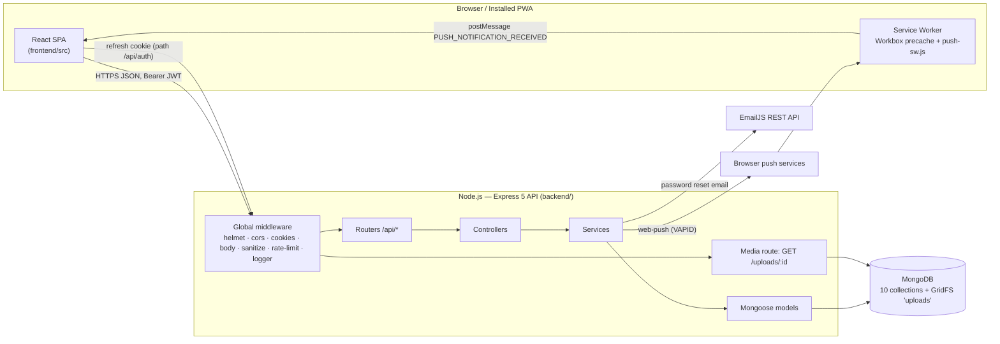

# 01 — Architecture & Layers

[← Index](README.md) · **01 Architecture** · [02 Database](02-database-and-schemas.md) · [03 Dependencies & Config](03-dependencies-and-config.md) · [04 File Inventory](04-file-inventory.md) · [05 API & Workflows](05-api-and-workflows.md)

## 1.1 Architectural Style

| Aspect | Decision |
|---|---|
| Overall | **Two-tier MERN application**: a React 19 single-page **PWA** and an Express 5 **REST API**, both in one repository with separate manifests (no monorepo tooling). |
| Backend style | **Layered monolith** — Routes → Middleware → Controllers → Services → Models (Mongoose) — with business rules in services and HTTP concerns in controllers. Services throw `httpError(status, msg)` and never touch `req`/`res`. |
| Tenancy | **Multi-tenant SaaS, shared database / shared schema**, row-level isolation by `companyId` derived from the JWT. A separate **platform tier** (`superadmin`) operates across tenants. |
| Data | MongoDB document model with embedded sub-documents (manuals, schedules, checklists) and references for high-cardinality relations (faults, maintenance, notifications). Binary media in **GridFS** in the same database. |
| Client state | React Context providers (no Redux); the server is the source of truth; optimistic UI only for the notification feed. |
| Real-time | **No websockets.** Near-live updates via polling (30 s page data, 20 s unread badge), visibility-change refetch, and Web Push → service-worker `postMessage`. |
| Deployment shape | Stateless API (sessions in DB, files in GridFS) → horizontally scalable; frontend is static assets + a generated service worker. Supported topologies: same-origin reverse proxy (`VITE_API_URL=/api`) or split origins (`VITE_API_URL=https://api…`, `FRONTEND_URL`, optional `COOKIE_DOMAIN`). |

## 1.2 System Context



## 1.3 Layer Mapping

### 1.3.1 Presentation / UI layer (`frontend/src`)

| Sub-layer | Location | Responsibility |
|---|---|---|
| Bootstrap | `main.jsx`, `index.html`, `index.css`, `theme/` | Mount, SW registration/update polling, MUI theme (light/dark), global CSS and accessibility classes. |
| Routing & guards | `routes.jsx`, `constants/routes.js`, `components/ProtectedRoute`, `components/RequireAdmin`, inline `RequireStaff`, `RequirePasswordChange` | Lazy route table, role-aware redirects, layout selection. |
| Layout shell | `components/Navbar/*`, `components/Legal/LegalFooter`, `components/AccessibilityMenu`, `components/PullToRefresh` | Responsive navigation (sidebar ≥ 1200 px, rail 600–1200 px, bottom bar < 600 px), footer, a11y tools, pull-to-refresh. |
| Pages | `pages/*` (17 screens + 2 aliases) | Screen composition, local UI state, data loading via services/contexts. |
| Feature components | `components/Fault/*`, `components/Tool/*`, `components/User/*`, `components/Notifications/*`, `components/LoginComponent/*` | Domain widgets, dialogs and forms. |
| Generic components | `ConfirmDialog`, `DialogComponent`, `ErrorComponent`, `LoadingComponent`, `Skeletons`, `Form/*`, `ImageViewer`, `PdfViewer`, `Logo`, `TabPanel` | Reusable building blocks. |
| State management | `contexts/*` | Auth/session, equipment and fault caches, toasts, notification feed, page-refresh registry, theme. |
| Data access (client) | `services/*` | One module per API area over a shared axios `apiClient` with token handling and silent refresh. |
| Utilities & hooks | `utils/*`, `hooks/*` | Sorting, retry/backoff, formatting, validation, media URL resolution, forms, push subscription, authenticated blob loading, gestures. |
| Static content | `content/legalDocuments.js` | Terms, Privacy, Accessibility statements (EN + HE). |
| Service worker | `public/push-sw.js` (+ Workbox) | Precaching, push display, app badge, click-through. |

### 1.3.2 API / Controller layer (`backend/app.js`, `routes/`, `middleware/`, `controllers/`)

Request pipeline (order defined in `app.js`):

```
helmet → cors(allow-list) → cookieParser → express.json(10mb) → express.urlencoded
  → sanitizeRequest ($ / dotted keys stripped) → rateLimit(500/15min) → HTTP access log
  → [route-specific] authLimiter / passwordResetLimiter
  → verifyToken (Bearer JWT, user + company reload, superadmin confinement, password gate)
  → role guard (ensureAdmin | ensureMechanicOrAdmin | ensureSuperAdmin)
  → validateObjectId(params) → multer (uploads)
  → controller → service
  → errorHandler (last)
```

Controllers are thin: they read `req.user.companyId` / `req.user.userId`, call one service function, choose the status code, write audit entries, and forward errors with `next(err)`.

### 1.3.3 Business logic / Service layer (`backend/services/`, `backend/utils/equipmentEngineHours.js`)

| Service | Domain | Core rules |
|---|---|---|
| `authService` | Identity & sessions | Company signup, login, JWT issue, refresh-token rotation with reuse detection, profile, avatar, password change/reset, self-deletion. |
| `userService` | Tenant user admin | Create (operator + forced change), role change, delete; self-protection; last-admin invariant. |
| `equipmentService` | Fleet, manuals, maintenance programs | Field whitelist, cascade delete, PDF manuals, schedule creation/completion, checklist, progress notes. |
| `faultService` | Fault lifecycle | Tenant-checked creation with photos, close/reopen/update/delete, engine-hours sync. |
| `maintenanceService` | Service history | Log creation/deletion with engine-hours sync. |
| `partService` | Spare parts | CRUD with tenant-checked tool reference. |
| `notificationService` | In-app notifications | Per-recipient fan-out, fault alerts, company and platform announcements, feed reads. |
| `pushService` | Web Push transport | VAPID config, subscription upsert/removal, best-effort delivery with pruning. |
| `superadminService` | Platform operations | KPIs/trends, company activation, cross-tenant user ops, temporary passwords, audit log queries. |
| `utils/equipmentEngineHours` | Derived data | Highest-wins engine hours + schedule status. |

### 1.3.4 Data access / Persistence layer (`backend/models/`, `backend/config/db.js`, `backend/utils/mediaStorage.js`)

Services use Mongoose models directly (no repository abstraction). `sanitizeFilter` is enabled globally; server-built operators are wrapped in `mongoose.trusted()`. GridFS access is encapsulated in `mediaStorage`. Indexes are declared on schemas; TTL indexes expire refresh tokens (at `expiresAt`) and audit logs (365 days). Full dictionary: [02](02-database-and-schemas.md).

### 1.3.5 Infrastructure & external integrations

| Integration | Module | Mode | Failure behaviour |
|---|---|---|---|
| MongoDB | `config/db.js` | Required | Process exits on connection failure; `/health` returns 503 when disconnected. |
| GridFS | `utils/mediaStorage.js` | Required for uploads | Upload errors propagate as 500; deletes are best-effort. |
| Web Push (VAPID) | `services/pushService.js` | Optional | Disabled without keys; delivery errors logged, dead endpoints pruned; never fails the triggering action. |
| EmailJS | `utils/mailer.js` | Optional in dev, needed for reset emails in production | Dev: logged to console. Production: throws, caught and logged; HTTP response unchanged. |
| Google Fonts | `frontend/index.html` | Optional | Falls back to the system font stack. |
| GitHub Actions | `.github/workflows/increment-build-version.yml` | CI | Builds the frontend only. |

## 1.4 Authorization Model (RBAC)

**Roles** (`constants/roles.js`): `operator` (default), `mechanic`, `admin` — tenant-scoped; `superadmin` — platform-scoped, no company, created only via CLI.

| Capability | operator | mechanic | admin | superadmin | Enforced by |
|---|:-:|:-:|:-:|:-:|---|
| Sign in, own profile, avatar, password, delete own account | ✔ | ✔ | ✔ | ✔ | `verifyToken` |
| View equipment list/detail, manuals, schedules | ✔ API · UI: manuals only | ✔ | ✔ | ✘ | `verifyToken`; UI `RequireStaff` hides `/equipment*` from operators |
| Create / edit / delete equipment | ✘ | ✘ | ✔ | ✘ | `ensureAdmin` |
| Upload/delete manuals; create/complete/delete schedules; checklist & progress | ✘ | ✔ | ✔ | ✘ | `ensureMechanicOrAdmin` |
| Report a fault (with photos) | ✔ | ✔ | ✔ | ✘ | `verifyToken` |
| List faults | ✔ (API returns all company faults; UI shows own) | ✔ | ✔ | ✘ | `verifyToken` |
| Close / reopen / edit / delete faults | ✘ | ✔ | ✔ | ✘ | `ensureMechanicOrAdmin` |
| Read maintenance logs | ✔ | ✔ | ✔ | ✘ | `verifyToken` |
| Create/delete maintenance logs; create/update/delete parts | ✘ | ✔ | ✔ | ✘ | `ensureMechanicOrAdmin` |
| Receive fault notifications | ✘ | ✔ | ✔ | ✘ | `notifyFaultReported` role filter |
| Own notification feed, push subscription | ✔ | ✔ | ✔ | ✘ | `verifyToken` + recipient scoping |
| Company announcement | ✘ | ✘ | ✔ | ✘ | `ensureAdmin` |
| Company user management | ✘ | ✘ | ✔ | ✘ | `ensureAdmin` + last-admin/self guards |
| Platform stats, companies, cross-tenant users, temporary passwords, audit log, platform announcements | ✘ | ✘ | ✘ | ✔ | `ensureSuperAdmin` |

**Superadmin confinement:** `verifyToken` rejects a superadmin on any path not starting with `/api/superadmin/`, `/api/auth/` or `/uploads/`; the frontend `ProtectedRoute` mirrors this (`/superadmin*`, `/account`, `/logout`).
**Password-change gate:** while `mustChangePassword` is true, only `POST /auth/me/change-password`, `/auth/logout` and `GET /auth/me` pass.

## 1.5 Cross-Cutting Concerns

### 1.5.1 Authentication & session management

- **Access token:** HS256 JWT `{ userId, role, companyId }`, 60 min, sent **only** as `Authorization: Bearer`. Stored client-side in `localStorage['token']` and the axios default header.
- **Refresh token:** HS256 JWT `{ userId, familyId, jti }`, 7 days, HTTP-only cookie scoped to `/api/auth`; persisted only as a SHA-256 hash (`RefreshToken`). Rotated on each use; reuse of a revoked token revokes the whole family (`TOKEN_REUSE_DETECTED`) unless it was rotated ≤ 30 s ago (multi-tab race).
- **Revocation triggers:** logout (that token), password change/reset (all of the user's), superadmin password reset (all of the user's), company deactivation (all of the company's), reuse detection (the family).
- **Per-request revalidation:** `verifyToken` reloads user and company on every call, so deletion or deactivation takes effect immediately even with a valid JWT.
- **CSRF stance:** cookie-based access auth was removed; the refresh cookie is `SameSite=Lax` (`None` only for the `COOKIE_DOMAIN` split deployment) and path-restricted.

### 1.5.2 Multi-tenant isolation

- Every tenant document carries `companyId`; every service query filters by the caller's `companyId` (from the token, never the body).
- Cross-references are validated in-tenant (fault / maintenance / part → tool).
- Foreign ids yield 404 (not 403), avoiding existence leaks; notifications additionally scope by `recipient`.
- Media: `/uploads/:id` serves files referenced by the caller's company and returns 403 for files referenced only by another company.
- Covered by `backend/__tests__/tenantIsolation.test.js` (37 cases).

### 1.5.3 Input validation & injection defence

- `sanitizeRequest` strips `$` and dotted keys from body/query/params; `sanitizeFilter` neutralizes operators in query filters; services check `typeof` on credentials.
- `validateObjectId` rejects malformed ids before DB access; Mongoose schema validators (`required`, `min`, `enum`) are the last line.
- Field whitelists for equipment and parts; the server ignores client-supplied `role`, `companyId`, `operator` and photo URLs.
- Regex search inputs are escaped (`superadminService.escapeRegex`).

### 1.5.4 Error handling

Services throw `httpError(status, message, { code })`; controllers forward with `next(err)`; `errorHandler` maps known error types (JSON syntax, Mongoose validation/cast, multer, CORS) and service errors, logs 4xx as `warn` and others as `error`, and hides 5xx messages in production. Side effects that must not fail the request (notifications, push, audit writes, reset emails, GridFS cleanup) are caught and logged. Frontend: `ErrorBoundary` at the root, `ErrorComponent` with retry per page, toasts via `useNotify`, and `retry()` with exponential backoff (500 ms, ×5, 3 retries, never on 401/403/404).

### 1.5.5 Logging & audit

- `utils/logger.js`: levels `error < warn < info < http < debug`, ANSI-coloured, ISO timestamps; default `warn` in production and `debug` elsewhere; silent under tests unless `TEST_LOGS`. Every request is logged at `http` level with method, URL, status and duration.
- `utils/audit.js` + `AuditLog`: 11 security/platform actions with actor/target snapshots and IP, retained 365 days, visible only to the superadmin.

### 1.5.6 Security headers, CORS & rate limiting

Helmet defaults + CSP `frame-ancestors` restricted to self and configured origins; CORP `cross-origin` for media. CORS allow-list from `FRONTEND_URL` (+ localhost outside production), credentials enabled, requests without an `Origin` allowed. Rate limits: see [05 §5.1](05-api-and-workflows.md#51-conventions). `trust proxy = 1` for correct client IPs behind a load balancer.

### 1.5.7 Files & media

Multer memory storage → GridFS `uploads` bucket; references `/uploads/<id>`; MIME allow-list and 50 MB cap. GridFS cleanup on avatar replacement, book removal, fault deletion, equipment deletion (books only) and account deletion. The client fetches media through `useAuthenticatedBlobUrl` so the Bearer token and silent refresh apply.

### 1.5.8 Offline / PWA

Workbox precaches the build assets (`autoUpdate`, update checks hourly and on foreground). There is **no offline data caching or request queueing**; API calls require connectivity. iOS Web Push requires the app installed to the home screen (`apple-mobile-web-app-capable`).

### 1.5.9 Accessibility & internationalization

ESLint `jsx-a11y`; skeletons announce loading via `role="status"`; accessible clickable rows; global focus ring; reduced-motion CSS; accessibility menu (font scale, contrast, link underline); the accessibility statement targets WCAG 2.0 AA / IS 5568. Legal documents are bilingual (English/Hebrew); the rest of the UI is English only.

## 1.6 Frontend Route Map

| Path | Page component | Guard chain | Who reaches it |
|---|---|---|---|
| `/` | redirect | — | → `/superadmin` (superadmin) or `/dashboard` |
| `/login` | `Login` | public | anyone (signed-in users are redirected) |
| `/reset-password` | `ResetPasswordPage` | public | anyone |
| `/terms`, `/privacy`, `/legal`, `/accessibility` | `LegalPage` | public | anyone |
| `/force-password-change` | `ForcePasswordChangePage` | `RequirePasswordChange` | users with `mustChangePassword` |
| `/dashboard` | `Dashboard` | `ProtectedRoute` | tenant users (role-specific view) |
| `/equipment` | `ToolsPage` → `EquipmentsPage` | `ProtectedRoute` + `RequireStaff` | mechanic, admin |
| `/equipment/:id` | `ToolPage` → `EquipmentPage` | `ProtectedRoute` + `RequireStaff` | mechanic, admin |
| `/equipment/:id/schedules/:scheduleId` | `EquipmentSchedulePage` | `ProtectedRoute` + `RequireStaff` | mechanic, admin |
| `/tools` | redirect → `/equipment` | — | legacy alias |
| `/tools/:id`, `/tools/:id/schedules/:scheduleId` | `ToolPage`, `EquipmentSchedulePage` | `ProtectedRoute` + `RequireStaff` | legacy aliases |
| `/logout` | `Logout` | `ProtectedRoute` | signed-in users |
| `/profile` | `ProfilePage` | `ProtectedRoute` | tenant users |
| `/account` | `AccountPage` | `ProtectedRoute` | all signed-in users incl. superadmin |
| `/admin` | `AdminDashboard` | `ProtectedRoute` + `RequireAdmin` | admin |
| `/superadmin/:tab?` | `SuperAdminDashboard` | `ProtectedRoute` + `RequireAdmin role=superadmin` | superadmin (`tab` ∈ `''`, `companies`, `users`, `audit`) |
| `/my-reports` | `OperatorReportsPage` | `ProtectedRoute` | tenant users |
| `/notifications` | `NotificationsPage` | `ProtectedRoute` | tenant users |
| `/manuals` | `EquipmentBooksPage` | `ProtectedRoute` | tenant users |
| `/books` | redirect → `/manuals` | — | legacy alias |
| `*` | `NotFound` | — | anyone |

**Navigation per role** (`components/Navbar/index.jsx`): superadmin → Overview, Companies, Users, Audit Log · operator → Dashboard, My Reports, Manuals · mechanic → Dashboard, Equipment, Manuals · admin → Dashboard, Equipment, Manuals, Admin (moved into the account sheet on phones). Phones also get a centre FAB that opens the global "report fault" dialog.

## 1.7 Naming Legacy: "Tool" vs "Equipment"

The domain was renamed from *Tool* to *Equipment*; both names remain for backward compatibility.

| Layer | Canonical | Alias |
|---|---|---|
| MongoDB collection | `tools` | — |
| Mongoose model | `Equipment` | `Tool` (same schema) |
| API | `/api/equipment` | `/api/tools`, `/api/admin/tools` |
| Controller | `equipmentController.js` | `toolController.js` |
| Frontend routes | `/equipment…` | `/tools…` |
| Frontend modules | `EquipmentContext`, `equipmentService`, `EquipmentsPage`, `EquipmentPage` | `ToolContext`, `toolsService`, `ToolsPage`, `ToolPage`, `EquipmentList`, `EquipmentPanel` |
| Field names | — | `Fault.tool`, `Maintenance.tool`, `Part.tool`, query `toolId`, response key `tools` |
