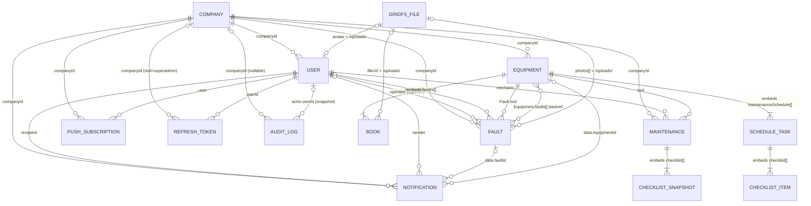

# 02 — Database & Schemas

[← Index](README.md) · [01 Architecture](01-architecture-and-layers.md) · **02 Database** · [03 Dependencies & Config](03-dependencies-and-config.md) · [04 File Inventory](04-file-inventory.md) · [05 API & Workflows](05-api-and-workflows.md)

**Engine:** MongoDB (via Mongoose 8.24.4). **No migrations framework** — schemas are defined in code (`backend/models/*.js`) and indexes are created by Mongoose `autoIndex` on model compile. One one-off data migration script exists (`backend/scripts/migrateUploadsToGridFS.js`).

**Global query guard:** `mongoose.set('sanitizeFilter', true)` ([`backend/config/db.js`](../../backend/config/db.js)). Any `$`-operator inside a query filter is wrapped as `{ $eq: … }` unless explicitly marked with `mongoose.trusted(...)`. Every server-built operator in the services (`$in`, `$ne`, `$gt`, `$gte`, `$or`) is therefore wrapped in `mongoose.trusted()`. The test harness ([`backend/__tests__/helpers/setup.js`](../../backend/__tests__/helpers/setup.js)) mirrors this setting.

**Multi-tenancy model:** shared database, shared collections, row-level isolation by a `companyId` field. Every tenant-scoped query includes `companyId` taken from the authenticated JWT user — never from request input.

---

## 2.1 Collection Map

| # | Mongoose model | MongoDB collection | Source file | Tenant-scoped | Purpose |
|---|---|---|---|---|---|
| 1 | `Company` | `companies` | `models/Company.js` | Root | A tenant organization. |
| 2 | `User` | `users` | `models/User.js` | Yes (`companyId`, null for superadmin) | Login identity + role. |
| 3 | `Equipment` (alias `Tool`) | **`tools`** | `models/Equipment.js`, `models/Tool.js` | Yes | A machine; embeds manuals and maintenance schedules. |
| 4 | `Fault` | `faults` | `models/Fault.js` | Yes | A reported problem on a machine. |
| 5 | `Maintenance` | `maintenances` | `models/Maintenance.js` | Yes | A completed service log entry. |
| 6 | `Notification` | `notifications` | `models/Notification.js` | Yes | One in-app notification per recipient. |
| 7 | `PushSubscription` | `pushsubscriptions` | `models/PushSubscription.js` | Yes | One browser Web Push endpoint. |
| 8 | `RefreshToken` | `refreshtokens` | `models/RefreshToken.js` | Yes (null for superadmin) | Hashed refresh token for rotation & reuse detection. |
| 9 | `AuditLog` | `auditlogs` | `models/AuditLog.js` | Optional (`companyId` nullable) | Append-only security/platform event log. |
| 10 | — (GridFS bucket `uploads`) | `uploads.files`, `uploads.chunks` | `utils/mediaStorage.js` | Indirect (via references) | Binary storage for photos, PDFs, avatars. |

> `Tool` is registered as a second Mongoose model name over the **same** `EquipmentSchema` and `tools` collection (`models/Equipment.js` lines 101–104). `models/Tool.js` simply re-exports `Equipment`. `ref: 'Tool'` (used by Fault, Maintenance, Notification) and `ref: 'Equipment'` resolve to the same documents.

---

## 2.2 Entity Relationship Diagram

**Relationship notes**

- **No database-level foreign keys or cascades exist** (MongoDB). All referential integrity is enforced in services:
  - `equipmentService.deleteTool` → deletes the equipment's own book files and its faults' photo files from GridFS (best-effort), then `Notification.deleteMany` (where `data.equipmentId` is the tool or `data.faultId` is one of its faults), `Fault.deleteMany` and `Maintenance.deleteMany`, all filtered by `companyId`.
  - `faultService.deleteFault` → deletes the fault's notifications (`data.faultId`), deletes photo files from GridFS, `$pull`s the fault id from `Equipment.faults`, re-syncs engine hours.
  - `authService.deleteAccount` → deletes `User`, all `RefreshToken`s, all `PushSubscription`s, and the avatar file.
  - `userService.deleteUser` (admin / superadmin) → deletes `User`, all `RefreshToken`s, all `PushSubscription`s, and the avatar file (same cleanup as self-deletion).
- `Equipment.faults[]` is a **denormalized back-reference** maintained by `faultService.createFault` (`$push`) and `deleteFault` (`$pull`). The canonical relation is `Fault.tool`.
- `Company` deletion is not implemented anywhere (only activate/deactivate).

---

## 2.3 `Company` — collection `companies`

Root of the tenant boundary. Created only by `authService.register` (self-service signup) or the seeder.

| Field | Type | Constraints / Attributes | Default | Description / Business Meaning |
|---|---|---|---|---|
| `_id` | ObjectId | PK | auto | Tenant id; copied into every scoped document as `companyId`. |
| `name` | String | required, trim | — | Display name (min 2 chars enforced in `authService.register`). |
| `slug` | String | required, **unique**, lowercase, trim | — | URL-safe id from `generateSlug(name)`; on collision suffixed with `-<Date.now() base36>`. |
| `isActive` | Boolean | — | `true` | When `false`: login → 403, refresh → 403, every `verifyToken` → 403. Toggled by superadmin. Deactivation revokes all the company's refresh tokens. |
| `createdAt` / `updatedAt` | Date | `timestamps: true` | auto | Drives superadmin "companies per month" and "new this month". |

**Indexes:** `_id`; `slug` (unique).

---

## 2.4 `User` — collection `users`

| Field | Type | Constraints / Attributes | Default | Description / Business Meaning |
|---|---|---|---|---|
| `_id` | ObjectId | PK | auto | User id; JWT claim `userId`. |
| `name` | String | required, trim, setter `formatUserName` | — | Title-cased on assignment and again in `pre('save')` (e.g. `mary-jane watson` → `Mary-Jane Watson`). |
| `email` | String | required, **unique (global)**, lowercase, trim | — | Login identifier. Unique across all tenants. |
| `role` | String | enum `operator \| mechanic \| admin \| superadmin` | `operator` | Access level (see [01 §1.4](01-architecture-and-layers.md#14-authorization-model-rbac)). |
| `avatar` | String | trim | `null` | `/uploads/<gridfsId>` reference or null. |
| `password` | String | required, `select: false` | — | bcrypt hash, 10 rounds (`BCRYPT_SALT_ROUNDS`). Never loaded unless a query asks for `+password` (login, password change, email change, self-deletion), so populated users never carry it. |
| `companyId` | ObjectId → `Company` | required unless `role === 'superadmin'`; indexed | — | Tenant scope. `null` for superadmin. |
| `mustChangePassword` | Boolean | — | `false` | `true` for admin-created users and after superadmin reset; gates all routes except change-password / logout / `GET /auth/me`. |
| `termsAccepted` | Boolean | — | `false` | Terms of Service & Privacy acceptance flag. |
| `termsAcceptedAt` | Date | — | `null` | Acceptance timestamp. |
| `termsVersion` | String | — | `null` | Version accepted at signup (`CURRENT_TERMS_VERSION = '1.3'` in `constants/auth.js`; `__tests__/termsVersion.test.js` fails if it drifts from the terms/privacy versions in `legalDocuments.js`). Not set by the forced-change flow. |
| `passwordResetTokenHash` | String | indexed, `select: false` | `null` | SHA-256 of the pending forgot-password token. |
| `passwordResetExpires` | Date | `select: false` | `null` | Token expiry (now + 30 min). |
| `lastActiveAt` | Date | — | `null` | Stamped on every login / register / refresh (`generateTokens`). Drives superadmin activity metrics. |
| `createdAt` / `updatedAt` | Date | timestamps | auto | — |

**Indexes:** `_id`; `email` (unique); `companyId`; `passwordResetTokenHash`.
**Hooks:** `pre('save')` re-applies `formatUserName`. **Statics:** `User.formatUserName` exported for reuse.
**Business invariants (service-enforced, `userService.js`):** a company must always keep ≥ 1 admin (cannot demote or delete the last admin); an admin cannot change their own role or delete themselves via the admin API; new admin-created users are always `operator` with `mustChangePassword: true`; superadmins are created only by the CLI script `scripts/createSuperAdmin.js`.

---

## 2.5 `Equipment` / `Tool` — collection `tools`

| Field | Type | Constraints / Attributes | Default | Description / Business Meaning |
|---|---|---|---|---|
| `_id` | ObjectId | PK | auto | Equipment id (used in routes as `:id`). |
| `companyId` | ObjectId → `Company` | required, indexed | — | Tenant scope. |
| `name` | String | required, trim | — | Machine name. |
| `serialNumber` | String | trim | — | Manufacturer serial. |
| `description` | String | trim | — | Free text. |
| `model` | String | trim | — | Model designation. |
| `localSerialNumber` | String | trim | — | Internal asset tag; the frontend sorts equipment by it (`sortToolsByLocalSerial`). |
| `currentEngineHours` | Number | min 0 | `0` | Hour-meter reading; kept "highest-wins" by `syncEquipmentEngineHours` ([§2.14](#213-derived-data-engine-hours-synchronization)). |
| `books` | `[EquipmentBook]` | embedded array | `[]` | Attached PDF manuals. |
| `maintenanceSchedule` | `[MaintenanceScheduleTask]` | embedded array | `[]` | Recurring service routines. |
| `faults` | `[ObjectId → Fault]` | — | `[]` | Denormalized back-reference list. Returned as ids by the list endpoint, populated by the detail endpoint. |
| `createdAt` / `updatedAt` | Date | timestamps | auto | Lists sort by `createdAt` desc. |

**Indexes:** `_id`; `companyId`; compound `{ companyId: 1, name: 1 }`.
**Client-writable fields** (whitelist `ALLOWED_EQUIPMENT_FIELDS` in `equipmentService.js`): `name, serialNumber, description, model, localSerialNumber, currentEngineHours` (the last parsed with `parseFloat` and dropped if NaN / negative).

### 2.5.1 Embedded `EquipmentBook` (`books[]`)

| Field | Type | Constraints | Default | Description |
|---|---|---|---|---|
| `_id` | ObjectId | auto subdoc id | auto | `:bookId` in routes. |
| `title` | String | required, trim | — | Display title (required by `addBook`). |
| `fileUrl` | String | required | — | `/uploads/<gridfsId>`. |
| `fileName` | String | — | — | Original upload filename. |
| `fileSize` | Number | — | — | Bytes. |
| `uploadedAt` | Date | — | `Date.now` | Upload time. |

### 2.5.2 Embedded `MaintenanceScheduleTask` (`maintenanceSchedule[]`)

| Field | Type | Constraints | Default | Description |
|---|---|---|---|---|
| `_id` | ObjectId | auto | auto | `:scheduleId` in routes. |
| `title` | String | required, trim | — | Routine name. |
| `description` | String | trim | — | Shown in the generated maintenance log text. |
| `intervalHours` | Number | — | `0` | Engine-hour recurrence; `0` = disabled. |
| `intervalDays` | Number | — | `0` | Calendar recurrence; `0` = disabled. |
| `lastPerformedHours` | Number | — | `0` | Reading at last completion (initialized to current hours on creation). |
| `lastPerformedDate` | Date | — | — | Last completion (initialized to creation time). |
| `nextDueHours` | Number | — | `0` | `currentEngineHours + intervalHours` when `intervalHours > 0`. |
| `nextDueDate` | Date | — | — | `now + intervalDays` when `intervalDays > 0`. |
| `status` | String | enum `normal \| due_soon \| overdue` | `normal` | Derived: remaining = `nextDueHours − currentEngineHours`; `≤ 0` overdue, `≤ 20` (`DUE_SOON_THRESHOLD_HOURS`) due_soon. **Only hour-based**; `nextDueDate` never affects status. |
| `checklist` | `[{ _id, text: String (required, trim), done: Boolean (default false) }]` | embedded | `[]` | Per-cycle to-do list; reset to `done:false` on completion. |
| `inProgressNotes` | String | trim | `''` | Work-in-progress notes; merged into the maintenance log and cleared on completion. |

---

## 2.6 `Fault` — collection `faults`

| Field | Type | Constraints / Attributes | Default | Description / Business Meaning |
|---|---|---|---|---|
| `_id` | ObjectId | PK | auto | — |
| `companyId` | ObjectId → `Company` | required, indexed | — | Tenant scope. |
| `code` | String | trim | — | Optional (server and frontend form). |
| `tool` | ObjectId → `Tool` | required | — | Machine; validated to belong to the same company on create. |
| `operator` | ObjectId → `User` | required | — | Reporter (from JWT, not body). |
| `description` | String | required, trim | — | Problem text. |
| `photos` | `[String]` | — | `[]` | `/uploads/<gridfsId>` refs. Only multipart uploads are accepted; URL strings in the body are ignored. Max 5 per request (`upload.array('photos', 5)`). |
| `engineHours` | Number | min 0 | — | Reading at report time. **Never** applied to the equipment directly. |
| `closingEngineHours` | Number | min 0 | — | Reading at close; the value that can raise `Equipment.currentEngineHours`. |
| `resolutionDescription` | String | trim | `''` | Resolution notes. Close accepts it under `resolutionDescription`, `notes` or `description`. |
| `resolvedBy` | ObjectId → `User` | — | — | Closer. |
| `status` | String | enum `open \| closed` | `open` | Lifecycle. |
| `closedAt` | Date | — | — | Close timestamp. |
| `createdAt` / `updatedAt` | Date | timestamps | auto | Lists sort by `createdAt` desc; dashboard chart buckets by it. |

**Indexes:** `_id`; `companyId`; `{ companyId, tool }`; `{ companyId, operator }`; `{ companyId, status }`.
**Lifecycle:** `open → closed` (`PATCH /:id/close`, or `PUT /:id` with `status: 'closed'`) → `open` (`/:id/reopen`, which `$unset`s `closedAt, closingEngineHours, resolutionDescription, resolvedBy`).

---

## 2.7 `Maintenance` — collection `maintenances`

| Field | Type | Constraints / Attributes | Default | Description / Business Meaning |
|---|---|---|---|---|
| `_id` | ObjectId | PK | auto | — |
| `companyId` | ObjectId → `Company` | required, indexed | — | Tenant scope. |
| `tool` | ObjectId → `Tool` | required | — | Machine serviced. |
| `mechanic` | ObjectId → `User` | required | — | Performer (from JWT). |
| `details` | String | required, trim | — | Work text, built by schedule completion (the only way records are created): `Routine: <title> - <description>\nNotes: <merged notes>`. |
| `engineHours` | Number | min 0 | — | Reading at service; contributes to highest-wins sync, and is passed as the removed reading when the record is deleted. |
| `checklist` | `[{ text: String (trim), done: Boolean (default true) }]` | embedded | `[]` | Snapshot of the task checklist at completion time. |
| `date` | Date | — | `Date.now` | When performed; lists sort by `date` desc. |
| `createdAt` / `updatedAt` | Date | timestamps | auto | — |

**Indexes:** `_id`; `companyId`; `{ companyId, tool }`; `{ companyId, mechanic }`.

---

## 2.8 `Notification` — collection `notifications`

Stored **per recipient** (a fault reported to five mechanics → five documents). Source of truth for the in-app feed; Web Push is a best-effort transport on top.

| Field | Type | Constraints / Attributes | Default | Description / Business Meaning |
|---|---|---|---|---|
| `_id` | ObjectId | PK | auto | Also sent in the push payload as `notificationId`. |
| `companyId` | ObjectId → `Company` | required, indexed | — | Tenant scope (platform announcements are split per company). |
| `recipient` | ObjectId → `User` | required, indexed | — | Owner of this copy. |
| `type` | String | required, enum `fault_reported \| announcement` | — | Drives icon/colour in UI. |
| `title` | String | required, trim | — | Headline; reused as push title (≤ 120 for announcements). |
| `body` | String | required, trim | — | Detail; reused as push body (≤ 1000 for announcements). |
| `link` | String | trim | `null` | In-app route on click: `/equipment/<id>?tab=faults` (fault) or `/notifications` (announcement). |
| `sender` | ObjectId → `User` | — | `null` | Reporter or broadcasting admin. |
| `data.faultId` | ObjectId → `Fault` | — | — | Deep-link reference. |
| `data.equipmentId` | ObjectId → `Tool` | — | — | Deep-link reference. |
| `readAt` | Date | — | `null` | `null` = unread. |
| `createdAt` / `updatedAt` | Date | timestamps | auto | — |

**Indexes:** `_id`; `companyId`; `recipient`; `{ recipient: 1, createdAt: -1 }` (feed); `{ recipient: 1, readAt: 1 }` (badge); `{ companyId: 1, createdAt: -1 }` (tenant sweeps).
**Retention:** none (no TTL); users delete their own via `DELETE /api/notifications/:id`.

---

## 2.9 `PushSubscription` — collection `pushsubscriptions`

| Field | Type | Constraints / Attributes | Default | Description / Business Meaning |
|---|---|---|---|---|
| `_id` | ObjectId | PK | auto | — |
| `companyId` | ObjectId → `Company` | required, indexed | — | Tenant scope. |
| `user` | ObjectId → `User` | required, indexed | — | Subscribed user (re-homed on re-registration from a shared device). |
| `endpoint` | String | required, **unique** | — | Browser push-service URL; upsert key. |
| `p256dh` | String | required | — | Client public key (base64url). |
| `auth` | String | required | — | Client auth secret (base64url). |
| `userAgent` | String | — | `null` | Truncated to 500 chars. |
| `createdAt` / `updatedAt` | Date | timestamps | auto | — |

**Indexes:** `_id`; `endpoint` (unique); `companyId`; `user`; `{ user: 1, companyId: 1 }`.
**Instance method:** `toWebPushSubscription()` → `{ endpoint, keys: { p256dh, auth } }`.
**Self-pruning:** rows are deleted when the push service answers 404/410 (`pushService.sendToUsers`).

---

## 2.10 `RefreshToken` — collection `refreshtokens`

Implements **refresh-token rotation (RTR) with reuse detection**.

| Field | Type | Constraints / Attributes | Default | Description / Business Meaning |
|---|---|---|---|---|
| `_id` | ObjectId | PK | auto | — |
| `userId` | ObjectId → `User` | required, indexed | — | Owner. |
| `companyId` | ObjectId → `Company` | indexed | `null` | Owner's tenant; null for superadmin. Used to revoke a whole company on deactivation. |
| `tokenHash` | String | required, indexed | — | SHA-256 hex of the raw JWT; raw token never stored. |
| `familyId` | String (UUID) | required, indexed | — | Rotation lineage; reuse of a revoked token revokes the whole family. |
| `isRevoked` | Boolean | — | `false` | Set on rotation, logout, password change/reset, company deactivation, reuse detection. |
| `wasRotated` | Boolean | — | `false` | `true` only for normal rotation → grants a 30 s race-tolerance window (`REFRESH_REUSE_GRACE_MS`). |
| `expiresAt` | Date | required | — | now + 7 days. |
| `createdAt` / `updatedAt` | Date | timestamps | auto | `updatedAt` is used to measure "revoked how long ago". |

**Indexes:** `_id`; `userId`; `companyId`; `tokenHash`; `familyId`; **TTL** `{ expiresAt: 1 }, expireAfterSeconds: 0` (auto-delete at expiry).

---

## 2.11 `AuditLog` — collection `auditlogs`

Append-only; written only by `utils/audit.js#recordAudit` (best-effort, never throws); read only by the superadmin audit view.

| Field | Type | Constraints / Attributes | Default | Description / Business Meaning |
|---|---|---|---|---|
| `_id` | ObjectId | PK | auto | — |
| `action` | String | required, enum `ALL_AUDIT_ACTIONS`, indexed | — | See action table below. |
| `actor` | `{ userId: ObjectId→User, name, email, role }` (sub-schema, `_id: false`) | — | `null` | Snapshot of who acted; `null` for anonymous (failed login). |
| `companyId` | ObjectId → `Company` | indexed | `null` | Tenant concerned. |
| `target` | `{ type: String, id: String, label: String }` (sub-schema, `_id: false`) | — | `null` | What was acted on (`user` or `company`). |
| `metadata` | Mixed | — | `{}` | e.g. `{ from, to }`, `{ role }`, `{ email, reason }`, `{ title, recipients, companies }`. |
| `ip` | String | — | `null` | `req.ip` (proxy-aware: `trust proxy = 1`). |
| `createdAt` | Date | `timestamps: { createdAt: true, updatedAt: false }` | auto | — |

**Indexes:** `_id`; `action`; `companyId`; `{ createdAt: -1 }`; **TTL** `{ createdAt: 1 }, expireAfterSeconds = 365 days` (`AUDIT_RETENTION_DAYS`).

| `action` value | Emitted by | Metadata |
|---|---|---|
| `company.registered` | `authController.register` | — (actor = new admin) |
| `company.activated` / `company.deactivated` | `superadminController.setCompanyStatus` | — |
| `user.created` | `userController.createUser` | `{ role }` |
| `user.role_changed` | `userController.updateUserRole`, `superadminController.updateUserRole` | `{ from, to }` |
| `user.deleted` | `userController.deleteUser`, `superadminController.deleteUser` | `{ role }` |
| `user.password_reset` | `superadminController.resetUserPassword` | — |
| `account.self_deleted` | `authController.deleteAccount` | — |
| `auth.superadmin_login` | `authController.login` (role = superadmin) | — |
| `auth.login_failed` | `authController.login` (4xx with a string email) | `{ email (≤254 chars, lowercased), reason }` |
| `announcement.platform_sent` | `superadminController.sendAnnouncement` | `{ title, recipients, companies }` |

The frontend mirror for labels/colours is `frontend/src/constants/audit.js` (`AUDIT_ACTION_INFO`, `describeAudit`).

---

## 2.12 GridFS bucket `uploads`

Managed by [backend/utils/mediaStorage.js](../../backend/utils/mediaStorage.js) (`bucketName: 'uploads'`).

| Collection | Content |
|---|---|
| `uploads.files` | File metadata: `_id` (ObjectId), `filename` (original name, or `avatar-<userId>`), `contentType`, `length`, `chunkSize`, `uploadDate`. |
| `uploads.chunks` | Binary chunks. |

**Reference format:** `/uploads/<gridfsObjectId>` stored in `Fault.photos[]`, `Equipment.books[].fileUrl`, `User.avatar`.
**Accepted MIME types** (`middleware/uploadMiddleware.js`): `image/jpeg`, `image/png`, `image/webp`, `image/gif`, `application/pdf`; 50 MB per file; in-memory buffer then streamed to GridFS.
**Superadmin storage KPI:** `uploads.files` aggregated `$sum: '$length'` (`superadminService.getStats`).

---

## 2.13 Derived Data: Engine-Hours Synchronization

`utils/equipmentEngineHours.js#syncEquipmentEngineHours(toolId, companyId, additionalCandidate = null, removedReading = null)`:

1. Loads the equipment (company-scoped).
2. `highest = equipment.currentEngineHours`, **unless** `removedReading` equals it — the record just reopened or deleted held the current reading — in which case `highest = 0`.
3. `highest = max(highest, every closed Fault.closingEngineHours > 0, every Maintenance.engineHours > 0, additionalCandidate > 0)`.
4. Writes `currentEngineHours = highest` and recomputes every hour-based schedule `status`.

| Caller | `additionalCandidate` | `removedReading` |
|---|---|---|
| `equipmentService.getToolById` (every detail read) | — | — |
| `equipmentService.completeSchedule` | completion reading | — |
| `faultService.closeFault` | closing reading | — |
| `faultService.reopenFault` | — | the fault's `closingEngineHours` before reopening |
| `faultService.updateFault` | — | previous `closingEngineHours`, read only when the update `$unset`s resolution fields (`status: open`) |
| `faultService.deleteFault` | — | the deleted fault's `closingEngineHours` |
| `maintenanceService.deleteMaintenance` | — | the deleted record's `engineHours` |

**Consequence:** the reading only rises, except that removing the record that held it lowers it to the highest remaining reading. A manually set reading (`PUT /api/equipment/:id`) is never lowered by a sync, unless a removed record's reading happens to equal it.

---

## 2.14 Seed Data (`backend/seeders/seeder.js`, dev only)

Refuses to run when `NODE_ENV=production`. Wipes `Company, User, Equipment, Maintenance, Fault, AuditLog` (not `Notification`, `PushSubscription`, `RefreshToken`, GridFS), then creates:

| Tenant | Users (role) | Data |
|---|---|---|
| Green Valley Forage & Dairy (`green-valley-forage-dairy`) | `admin@greenvalleyfarm.com` (admin), `mechanic@greenvalleyfarm.com` (mechanic), `operator@greenvalleyfarm.com` (operator, `mustChangePassword`) | Equipment with schedules/checklists, maintenance logs, faults (linked into `Equipment.faults`). |
| Prairie Crest Grain & Hay (`prairie-crest-grain-hay`) | `admin@`, `mechanic@`, `operator@prairiecrestfarm.com` | Same shape. |
| — | `superadmin@fixfleet.dev` (superadmin, no company) | — |

One random password (`crypto.randomBytes(12).toString('base64url')`) is generated per run, printed once, and shared by all seeded users. Two `company.registered` audit entries are inserted.
