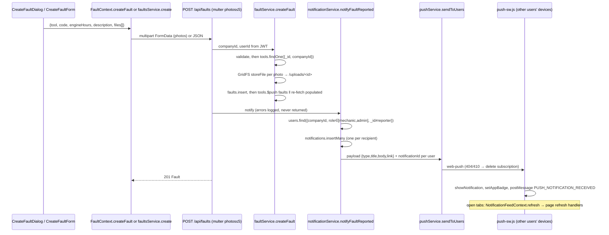

# 05 — API Contract & End-to-End Workflows

[← Index](README.md) · [01 Architecture](01-architecture-and-layers.md) · [02 Database](02-database-and-schemas.md) · [03 Dependencies & Config](03-dependencies-and-config.md) · [04 File Inventory](04-file-inventory.md) · **05 API & Workflows**

## 5.1 Conventions

| Aspect | Rule |
|---|---|
| Base path | `/api` (frontend `VITE_API_URL`, default `/api`). Media: `/uploads/:id` (outside `/api`). Health: `/health` and `/api/health`. |
| Auth transport | `Authorization: Bearer <accessToken>` **only**. Cookies never authenticate API calls. The `refreshToken` HTTP-only cookie (path `/api/auth`) is used only by `/auth/refresh` and `/auth/logout`. |
| Access token | HS256 JWT, claims `{ userId, role, companyId }`, 60 min. |
| Refresh token | HS256 JWT signed with `JWT_REFRESH_SECRET` (fallback `${JWT_SECRET}_refresh`), claims `{ userId, familyId, jti }`, 7 days. |
| Body formats | JSON (`express.json`, 10 MB) · urlencoded · multipart (multer, memory, 50 MB/file, jpeg/png/webp/gif/pdf). |
| Sanitization | Keys starting with `$` or containing `.` are deleted from `body`, `query`, `params` (`sanitizeRequest`). |
| ID params | `validateObjectId(...)` → `400 { message: "Invalid <param> format" }` before any DB access. |
| Pagination | List endpoints for equipment, faults, maintenance and parts return a **plain array** when neither `page` nor `limit` is supplied, otherwise `{ <items>, page, limit, total, pages }`. `limit` clamped to 1–100 (default 20). Notifications and superadmin lists are always paginated. |
| Error body | `{ message: string, code?: string }`. 4xx messages are always returned; 5xx message is `"Server error"` in production. |
| Rate limits | Global 500 req / 15 min / IP. `/auth/register|login|refresh|forgot-password|reset-password`: +20 / 15 min / IP. `/auth/forgot-password`: +3 / 15 min **per email**. All skipped when `NODE_ENV=test`. Auth `429` body: `{ message: "Too many attempts from this IP, please try again after 15 minutes" }`. |

### 5.1.1 Global error mapping (`middleware/errorMiddleware.js`)

| Condition | Status | Body `message` |
|---|---|---|
| Malformed JSON body | 400 | `Invalid JSON payload` |
| Mongoose `ValidationError` | 400 | Joined validator messages |
| Mongoose `CastError` | 400 | `Invalid <path>: <value>` |
| `MulterError` (e.g. size) | 400 | Multer message |
| Multer file-filter rejection | **500** (plain `Error`, no status) | `Only image files (jpeg, png, webp, gif) and PDF documents are allowed` (masked as `Server error` in production) |
| CORS rejection | 403 | `CORS forbidden` |
| `httpError(status, msg, {code})` from services | `status` | `msg` (+ `code`) |
| Anything else | 500 | real message (dev) / `Server error` (prod) |

### 5.1.2 Authentication middleware responses (`verifyToken`)

| Condition | Status | Body |
|---|---|---|
| No `Bearer` header | 401 | `{ message: "No token provided" }` |
| Expired token | 401 | `{ message: "Token expired", code: "TOKEN_EXPIRED" }` |
| Invalid signature / malformed | 401 | `{ message: "Invalid or expired token" }` |
| User deleted | 401 | `{ message: "User not found or deleted" }` |
| Tenant user, company missing/inactive | 403 | `{ message: "Company account is inactive or not found" }` |
| Superadmin on a path outside `/api/superadmin/`, `/api/auth/`, `/uploads/` | 403 | `{ message: "Forbidden: tenant routes are not available to superadmins" }` |
| `mustChangePassword` and path ∉ {`/auth/me/change-password`, `/auth/logout`, `GET /auth/me`} | 403 | `{ message: "Password change required before accessing system resources", code: "PASSWORD_CHANGE_REQUIRED", mustChangePassword: true }` |

Role guards: `ensureAdmin` → `403 "Forbidden: Admins only"`; `ensureMechanicOrAdmin` → `403 "Forbidden: Mechanics or Admins only"`; `ensureSuperAdmin` → `403 "Forbidden: Superadmins only"`.

### 5.1.3 Shared response shapes

**`UserProfile`** (register / login — `shapeUserProfile`):
```json
{ "id": "665f…", "_id": "665f…", "name": "Megan Carter", "email": "admin@example.com", "role": "admin",
  "avatar": null, "mustChangePassword": false, "termsAccepted": true,
  "company": { "id": "665e…", "_id": "665e…", "name": "Green Valley", "slug": "green-valley" } }
```
`GET /auth/me` returns the same keys but `company` is the **full** Company document (`{ _id, name, slug, isActive, createdAt, updatedAt }`) or `null` for a superadmin. `PUT /auth/me` omits `company`. `POST /auth/me/avatar` returns `{ id, _id, name, email, role, avatar, company }` (full company).

**`Fault` (populated):** list/create/update populate `tool: { _id, name, serialNumber, model, currentEngineHours }` and `operator` / `resolvedBy: { _id, name, email, role }`. `GET /faults/:id` populates the full `tool`. **`close` and `reopen` populate full `tool`, `operator` and `resolvedBy` documents with no field selection — the populated users include the `password` hash** (see [Audit Observations](README.md#7-audit-observations)).

**`Equipment`:** Equipment document; list endpoint populates `faults` (full Fault docs); detail endpoint populates `faults.operator` (`name email`).

---

## 5.2 Endpoint Reference

Legend — **Auth:** `—` public · `JWT` any authenticated tenant user · `M/A` mechanic or admin · `A` admin · `SA` superadmin. Every `JWT` route is also subject to the password-change gate and the superadmin path confinement in §5.1.2.

### 5.2.1 System (`backend/app.js`)

| Method | Path | Auth | Request | Response |
|---|---|---|---|---|
| GET | `/health`, `/api/health` | — | — | `200 { status: "healthy", timestamp, database: "connected" }` or `503 { status: "degraded", …, database: "disconnected" }` |
| GET | `/uploads/:filename` | JWT (superadmin allowed) | `:filename` = GridFS id | Binary stream with `Content-Type`, `Content-Length`. `404 { message: "Media file not found" }` if unknown; `403 { message: "Forbidden: Cannot access media belonging to another organization" }` if referenced only by another company; served if referenced by the caller's company **or by no document at all**. |

### 5.2.2 Auth — `/api/auth` (`authRoutes.js` → `authController.js` → `authService.js`)

| Method | Path | Auth / Limits | Request body | Success response | Errors |
|---|---|---|---|---|---|
| POST | `/register` | — · authLimiter | `{ companyName (≥2), name (≥2), email, password (≥8), agreeToTerms: true \| termsAccepted: true }` | `201 { message, accessToken, token, user: UserProfile }` + `Set-Cookie: refreshToken` | 400 field validation / `User with this email already exists` / terms not agreed |
| POST | `/login` | — · authLimiter | `{ email, password }` | `200 { accessToken, token, user: UserProfile }` + cookie | 400 `Valid email and password are required` / `Invalid credentials`; 403 `Company account is inactive` |
| POST | `/refresh` | — · authLimiter | cookie `refreshToken` (or body `{ refreshToken }`) | `200 { accessToken, token }` + rotated cookie | 401 missing / invalid / not recognized / user deleted; 403 company inactive; 403 `code: TOKEN_REUSE_DETECTED` (+ cookies cleared) |
| POST | `/forgot-password` | — · authLimiter · per-email limiter | `{ email }` | `200 { message: "If an account exists for that email, a reset link has been sent." }` (always) | 400 invalid email |
| POST | `/reset-password` | — · authLimiter | `{ token, newPassword (≥8) }` | `200 { message: "Password has been reset. You can now sign in." }` | 400 `Reset link is invalid or has expired` / short password |
| POST | `/logout` | — | cookie/body refresh token (optional) | `200 { message: "Logged out successfully" }`; clears `refreshToken` plus legacy `token`, `accessToken` cookies | — |
| GET | `/me` | JWT (allowed during password gate; superadmin allowed) | — | `200` profile with full company | 404 |
| PUT | `/me` | JWT | `{ name (≥2), email, currentPassword? }` — password required only if email changes | `200` profile (no company) | 400 validation / `Current password is required to change your email address` / `Current password is incorrect` / `Email already in use` |
| DELETE | `/me` | JWT | `{ confirmation: "delete <Full Name>" (case-insensitive), currentPassword }` | `200 { message: "Account deleted successfully" }`; cookies cleared; audit `account.self_deleted` | 400 bad confirmation / password |
| POST | `/me/avatar` | JWT | multipart field `avatar` | `200` profile with `avatar: "/uploads/<id>"`; previous avatar file deleted | 400 `Avatar image file is required` |
| POST | `/me/change-password` | JWT (allowed during password gate) | `{ currentPassword (not required when mustChangePassword), newPassword (≥8), agreeToTerms? / termsAccepted? (required if forced and terms not yet accepted) }` | `200 { message: "Password changed successfully", mustChangePassword: false, termsAccepted }`; **all refresh tokens revoked** | 400 missing / short / incorrect current / terms |

### 5.2.3 Equipment — `/api/equipment` (alias `/api/tools`) (`equipmentRoutes.js` → `equipmentController.js` → `equipmentService.js`)

All routes: `verifyToken`.

| Method | Path | Auth | Request | Response | Notes |
|---|---|---|---|---|---|
| GET | `/` | JWT | `?page&limit` | `Equipment[]` or `{ tools, page, limit, total, pages }` | `faults` populated; newest first. |
| GET | `/:id` | JWT | — | `Equipment` | Runs `syncEquipmentEngineHours` first; 404 `Equipment not found`. |
| POST | `/` | A | `{ name*, serialNumber, description, model, localSerialNumber, currentEngineHours }` | `201 Equipment` | 400 `No data provided` / `Equipment name is required`. |
| PUT | `/:id` | A | any subset of the whitelist | `200 Equipment` | 400 `No valid fields provided for update`; 404. |
| DELETE | `/:id` | A | — | `204` | Cascades: book files, faults, parts, maintenance of this tool. |
| POST | `/:id/books` | M/A | multipart: `book` (file*), `title`* | `201 Equipment` | 400 `PDF document is required` / `Book title is required`; 404 checked **before** storing the file. |
| DELETE | `/:id/books/:bookId` | M/A | — | `200 Equipment` | GridFS file deleted. |
| POST | `/:id/schedules` | M/A | `{ title*, description, intervalHours, intervalDays, checklist: (string \| {text})[] }` | `201 Equipment` | Sets `lastPerformed*` = now / current hours, computes `nextDue*`. |
| GET | `/:id/schedules/:scheduleId` | JWT | — | `{ equipment, schedule }` | 404 `Maintenance schedule not found`. |
| DELETE | `/:id/schedules/:scheduleId` | M/A | — | `200 Equipment` | — |
| POST | `/:id/schedules/:scheduleId/complete` | M/A | `{ currentEngineHours?, notes? }` | `200 Equipment` (post-sync) | Creates a `Maintenance` record; see §5.3.6. |
| PATCH \| PUT \| POST | `/:id/schedules/:scheduleId/progress` | M/A | `{ inProgressNotes }` | `{ equipment, schedule }` | Three verbs → one handler. |
| POST | `/:id/schedules/:scheduleId/checklist` | M/A | `{ text* }` | `201 { equipment, schedule }` | 400 `Task text is required`. |
| PATCH | `/:id/schedules/:scheduleId/checklist/:itemId` | M/A | — | `{ equipment, schedule }` | Toggles `done`. |
| DELETE | `/:id/schedules/:scheduleId/checklist/:itemId` | M/A | — | `{ equipment, schedule }` | — |

### 5.2.4 Faults — `/api/faults` (`faultRoutes.js` → `faultController.js` → `faultService.js`)

| Method | Path | Auth | Request | Response | Notes |
|---|---|---|---|---|---|
| GET | `/` | JWT | `?status=open\|closed&mine=<truthy>&page&limit` | `Fault[]` or `{ faults, page, limit, total, pages }` | `mine` filters `operator = caller`. Every role can list all company faults. |
| GET | `/:id` | JWT | — | `Fault` | 404 `Fault not found`. |
| POST | `/` | JWT (any role) | JSON or multipart: `tool*`, `description*`, `code`, `engineHours`, files `photos` (≤ 5) | `201 Fault` | 400 `Description is required` / `Tool reference is required` / `Referenced tool does not exist in your organization`. Triggers fault notification (failures logged, never surfaced). |
| PUT | `/:id` | M/A | `{ description, code, engineHours, resolutionDescription, status }` | `200 Fault` | `status: closed` sets `closedAt`, `resolvedBy`; `status: open` unsets resolution fields. Re-syncs hours. (Controller JSDoc says PATCH; only PUT is routed.) |
| PATCH | `/:id/close` | M/A | `{ engineHours?, resolutionDescription? \| notes? \| description? }` | `200 Fault` | Sets `closingEngineHours` when valid ≥ 0; re-syncs hours with it as candidate. |
| PUT \| PATCH | `/:id/reopen` | M/A | — | `200 Fault` | Unsets `closedAt, closingEngineHours, resolutionDescription, resolvedBy`. |
| DELETE | `/:id` | M/A | — | `200 { message: "Fault deleted successfully" }` | Deletes photo files, pulls back-reference, re-syncs. |

### 5.2.5 Maintenance logs — `/api/maintenance`

| Method | Path | Auth | Request | Response |
|---|---|---|---|---|
| GET | `/` | JWT | `?toolId&page&limit` | `Maintenance[]` (tool: `name serialNumber model`, mechanic: `name email`, sorted `date` desc) or `{ logs, page, limit, total, pages }` |
| GET | `/:id` | JWT | — | `Maintenance` (full tool) · 404 `Maintenance record not found` |
| POST | `/` | M/A | `{ tool*, details*, date?, engineHours? }` | `201 Maintenance` (tool incl. `currentEngineHours`) |
| DELETE | `/:id` | M/A | — | `200 { message: "Maintenance record deleted successfully" }` |

The frontend uses only `GET /` (by `toolId`) and `DELETE /:id`.

### 5.2.6 Parts — `/api/parts` (no frontend consumer)

| Method | Path | Auth | Request | Response |
|---|---|---|---|---|
| GET | `/` | JWT | `?page&limit` | `Part[]` (tool `name serialNumber model`) or `{ parts, page, limit, total, pages }` |
| POST | `/` | M/A | `{ name*, partNumber, tool, inStock }` | `201 Part` · 400 `Part name is required` / foreign tool |
| PUT | `/:id` | M/A | subset of the above | `200 Part` · 400 `Part name cannot be empty` · 404 `Part not found` |
| DELETE | `/:id` | M/A | — | `200 { message: "Part deleted successfully" }` |

### 5.2.7 Notifications — `/api/notifications`

All routes: `verifyToken`; every read/write is scoped by `{ companyId, recipient: caller }`. Literal paths are declared before `/:id` so they are never shadowed.

| Method | Path | Auth | Request | Response |
|---|---|---|---|---|
| GET | `/` | JWT | `?page&limit (≤100, default 20)&unreadOnly=true` | `{ notifications (sender populated: name role avatar), unreadCount, page, limit, total, pages }` |
| GET | `/unread-count` | JWT | — | `{ unreadCount }` |
| POST | `/read-all` | JWT | — | `{ updated }` |
| GET | `/push/public-key` | JWT | — | `{ enabled: boolean, publicKey: string }` |
| POST | `/push/subscriptions` | JWT | `{ subscription: { endpoint, keys: { p256dh, auth } } }` or the raw subscription | `201 { subscribed: true }` · 400 malformed |
| DELETE | `/push/subscriptions` | JWT | `{ endpoint }` | `{ removed: boolean }` · 400 missing endpoint |
| POST | `/announcements` | A | `{ title* (≤120), body* (≤1000), roles?: ('operator'\|'mechanic'\|'admin')[] }` | `201 { recipients: number }` · 400 empty / too long / unknown role / empty roles / `No users match the selected recipients` |
| PATCH | `/:id/read` | JWT | — | Updated notification (idempotent) · 404 if not the caller's |
| DELETE | `/:id` | JWT | — | `204` · 404 if not the caller's |

### 5.2.8 Company administration — `/api/admin` (all: `verifyToken` + `ensureAdmin`)

| Method | Path | Request | Response | Notes |
|---|---|---|---|---|
| GET | `/users` | — | `User[]` (no password), newest first | Company users only. |
| POST | `/users` | `{ name* (≥2), email*, password* (≥8) }` (`role` ignored) | `201 User` (role `operator`, `mustChangePassword: true`) | Audit `user.created`. |
| PATCH | `/users/:id/role` | `{ role: operator\|mechanic\|admin }` | `200 User` | 400 self-change / invalid / last admin. Audit `user.role_changed`. |
| DELETE | `/users/:id` | — | `204` | 400 self-delete / last admin. Audit `user.deleted`. |
| GET / POST | `/equipment`, `/tools` | as `/api/equipment` | as `/api/equipment` | Alias of equipment list/create. |
| PUT / DELETE | `/equipment/:id`, `/tools/:id` | as `/api/equipment/:id` | as `/api/equipment/:id` | Alias. |

### 5.2.9 Platform administration — `/api/superadmin` (all: `verifyToken` + `ensureSuperAdmin`)

| Method | Path | Request | Response | Audit |
|---|---|---|---|---|
| GET | `/stats` | — | `{ totals: { companies, activeCompanies, newCompaniesThisMonth, users, newUsersThisMonth, activeUsers, storageBytes, storedFiles }, activeWindowDays: 30, companiesPerMonth: [{ month: 'YYYY-MM', count }]×12, usersPerMonth: […]×12, largestCompanies: [{ companyId, name, users }]≤10, attention: { inactiveCompanies, dormantCompanies, dormantSample: [{ _id, name, lastActiveAt }]≤5 } }` | — |
| GET | `/companies` | `?search` (name/slug, case-insensitive) | `[Company + { userCount, lastActiveAt }]` | — |
| GET | `/companies/:id` | — | `{ company, users (no password) }` | — |
| PATCH | `/companies/:id/status` | `{ isActive: boolean }` | `Company` | `company.activated` / `company.deactivated` |
| GET | `/users` | `?search&companyId&role&page&limit` | `{ users (companyId populated: name slug isActive), page, limit, total, pages }` | — |
| PATCH | `/users/:id/role` | `{ role }` | `User` | `user.role_changed` |
| POST | `/users/:id/reset-password` | — | `{ temporaryPassword }` (12-char base64url; user gets `mustChangePassword`, sessions revoked) | `user.password_reset` |
| DELETE | `/users/:id` | — | `204` | `user.deleted` |
| POST | `/announcements` | `{ title*, body*, roles?, companyIds?: ObjectId[] }` | `201 { recipients, companies }` | `announcement.platform_sent` |
| GET | `/audit-logs` | `?action&companyId&search&page&limit` | `{ logs (companyId populated: name), page, limit, total, pages }` | — |

Superadmin user operations refuse to touch other superadmins (`404 User not found`) and reuse the tenant last-admin guard.

---

## 5.3 End-to-End Traces

Notation: **UI → Context/Service (frontend) → Route → Middleware → Controller → Service → Collection → Response → UI effect**.

### 5.3.1 Company self-service registration

```drawio
<mxfile>
  <diagram id="3F6rBkRDhGhRA-G3Fl36" name="Page-1">
    <mxGraphModel dx="2" dy="1" grid="0" gridSize="10" guides="1" tooltips="0" connect="0" arrows="0" fold="0" page="0" pageScale="1" pageWidth="850" pageHeight="1100" math="0" shadow="0">
      <root>
        <mxCell id="XY2LPMRHiWKs-SErpu0r-0" />
        <mxCell id="XY2LPMRHiWKs-SErpu0r-1" parent="XY2LPMRHiWKs-SErpu0r-0" />
        <UserObject label="" mermaidData="{&#xa;  &quot;data&quot;: &quot;sequenceDiagram\n    participant UI as SignupForm.jsx\n    participant AC as AuthContext.signup\n    participant API as POST /api/auth/register\n    participant SVC as authService.register\n    participant DB as MongoDB\n    UI-&gt;&gt;AC: {companyName,name,email,password,agreeToTerms}\n    AC-&gt;&gt;API: apiClient.post (name pre-formatted)\n    API-&gt;&gt;API: sanitizeRequest, global limiter, authLimiter\n    API-&gt;&gt;SVC: authController.register(req.body)\n    SVC-&gt;&gt;DB: users.findOne(email) ‖ companies.findOne(slug) ‖ bcrypt.hash\n    SVC-&gt;&gt;DB: companies.insert {name, slug, isActive:true}\n    SVC-&gt;&gt;DB: users.insert {role:&#39;admin&#39;, termsVersion:&#39;1.3&#39;, …}\n    Note over SVC,DB: on user insert failure → companies.delete (compensating action)\n    SVC-&gt;&gt;DB: users.update lastActiveAt; refreshtokens.insert {tokenHash,familyId}\n    API-&gt;&gt;DB: auditlogs.insert company.registered\n    API--&gt;&gt;AC: 201 {accessToken, token, user} + Set-Cookie refreshToken\n    AC-&gt;&gt;AC: apiClient.setToken (localStorage &#39;token&#39;); setUser\n    AC--&gt;&gt;UI: navigate(&#39;/dashboard&#39;)&quot;,&#xa;  &quot;config&quot;: null&#xa;}" id="yyksDZMcHd3UIHkJnr4--0">
          <mxCell connectable="0" parent="XY2LPMRHiWKs-SErpu0r-1" style="group;transparentBounds=1;editIcon=1;lockedGroup=0;groupPadding=10;" vertex="1">
            <mxGeometry as="geometry" />
          </mxCell>
        </UserObject>
        <UserObject label="SignupForm.jsx" mermaidId="n:UI" mermaidBaseStyle="html=1;shape=umlLifeline;perimeter=lifelinePerimeter;whiteSpace=wrap;container=1;dropTarget=0;collapsible=0;recursiveResize=0;outlineConnect=0;portConstraint=eastwest;newEdgeStyle={&quot;edgeStyle&quot;:&quot;elbowEdgeStyle&quot;,&quot;elbow&quot;:&quot;vertical&quot;,&quot;curved&quot;:0,&quot;rounded&quot;:0};lifelineDashed=0;strokeWidth=2;rounded=1;absoluteArcSize=1;arcSize=6;lifelineColor=light-dark(#9370DB,#cccccc);size=65;lifelineMirror=1;fillColor=light-dark(#ECECFF,#1f2020);strokeColor=light-dark(#9370DB,#cccccc);fontColor=light-dark(#333333,#cccccc);fontFamily=Trebuchet MS,Verdana,Arial,sans-serif;fontSize=16;" mermaidBaseValue="SignupForm.jsx" id="XY2LPMRHiWKs-SErpu0r-2">
          <mxCell parent="yyksDZMcHd3UIHkJnr4--0" style="html=1;shape=umlLifeline;perimeter=lifelinePerimeter;whiteSpace=wrap;container=1;dropTarget=0;collapsible=0;recursiveResize=0;outlineConnect=0;portConstraint=eastwest;newEdgeStyle={&quot;edgeStyle&quot;:&quot;elbowEdgeStyle&quot;,&quot;elbow&quot;:&quot;vertical&quot;,&quot;curved&quot;:0,&quot;rounded&quot;:0};lifelineDashed=0;strokeWidth=2;rounded=1;absoluteArcSize=1;arcSize=6;lifelineColor=light-dark(#9370DB,#cccccc);size=65;lifelineMirror=1;fillColor=light-dark(#ECECFF,#1f2020);strokeColor=light-dark(#9370DB,#cccccc);fontColor=light-dark(#333333,#cccccc);fontFamily=Trebuchet MS,Verdana,Arial,sans-serif;fontSize=16;" vertex="1">
            <mxGeometry height="882" width="150" x="10" y="10" as="geometry" />
          </mxCell>
        </UserObject>
        <UserObject label="AuthContext.signup" mermaidId="n:AC" mermaidBaseStyle="html=1;shape=umlLifeline;perimeter=lifelinePerimeter;whiteSpace=wrap;container=1;dropTarget=0;collapsible=0;recursiveResize=0;outlineConnect=0;portConstraint=eastwest;newEdgeStyle={&quot;edgeStyle&quot;:&quot;elbowEdgeStyle&quot;,&quot;elbow&quot;:&quot;vertical&quot;,&quot;curved&quot;:0,&quot;rounded&quot;:0};lifelineDashed=0;strokeWidth=2;rounded=1;absoluteArcSize=1;arcSize=6;lifelineColor=light-dark(#9370DB,#cccccc);size=65;lifelineMirror=1;fillColor=light-dark(#ECECFF,#1f2020);strokeColor=light-dark(#9370DB,#cccccc);fontColor=light-dark(#333333,#cccccc);fontFamily=Trebuchet MS,Verdana,Arial,sans-serif;fontSize=16;" mermaidBaseValue="AuthContext.signup" id="XY2LPMRHiWKs-SErpu0r-3">
          <mxCell parent="yyksDZMcHd3UIHkJnr4--0" style="html=1;shape=umlLifeline;perimeter=lifelinePerimeter;whiteSpace=wrap;container=1;dropTarget=0;collapsible=0;recursiveResize=0;outlineConnect=0;portConstraint=eastwest;newEdgeStyle={&quot;edgeStyle&quot;:&quot;elbowEdgeStyle&quot;,&quot;elbow&quot;:&quot;vertical&quot;,&quot;curved&quot;:0,&quot;rounded&quot;:0};lifelineDashed=0;strokeWidth=2;rounded=1;absoluteArcSize=1;arcSize=6;lifelineColor=light-dark(#9370DB,#cccccc);size=65;lifelineMirror=1;fillColor=light-dark(#ECECFF,#1f2020);strokeColor=light-dark(#9370DB,#cccccc);fontColor=light-dark(#333333,#cccccc);fontFamily=Trebuchet MS,Verdana,Arial,sans-serif;fontSize=16;" vertex="1">
            <mxGeometry height="882" width="150" x="442" y="10" as="geometry" />
          </mxCell>
        </UserObject>
        <UserObject label="POST /api/auth/register" mermaidId="n:API" mermaidBaseStyle="html=1;shape=umlLifeline;perimeter=lifelinePerimeter;whiteSpace=wrap;container=1;dropTarget=0;collapsible=0;recursiveResize=0;outlineConnect=0;portConstraint=eastwest;newEdgeStyle={&quot;edgeStyle&quot;:&quot;elbowEdgeStyle&quot;,&quot;elbow&quot;:&quot;vertical&quot;,&quot;curved&quot;:0,&quot;rounded&quot;:0};lifelineDashed=0;strokeWidth=2;rounded=1;absoluteArcSize=1;arcSize=6;lifelineColor=light-dark(#9370DB,#cccccc);size=65;lifelineMirror=1;fillColor=light-dark(#ECECFF,#1f2020);strokeColor=light-dark(#9370DB,#cccccc);fontColor=light-dark(#333333,#cccccc);fontFamily=Trebuchet MS,Verdana,Arial,sans-serif;fontSize=16;" mermaidBaseValue="POST /api/auth/register" id="XY2LPMRHiWKs-SErpu0r-4">
          <mxCell parent="yyksDZMcHd3UIHkJnr4--0" style="html=1;shape=umlLifeline;perimeter=lifelinePerimeter;whiteSpace=wrap;container=1;dropTarget=0;collapsible=0;recursiveResize=0;outlineConnect=0;portConstraint=eastwest;newEdgeStyle={&quot;edgeStyle&quot;:&quot;elbowEdgeStyle&quot;,&quot;elbow&quot;:&quot;vertical&quot;,&quot;curved&quot;:0,&quot;rounded&quot;:0};lifelineDashed=0;strokeWidth=2;rounded=1;absoluteArcSize=1;arcSize=6;lifelineColor=light-dark(#9370DB,#cccccc);size=65;lifelineMirror=1;fillColor=light-dark(#ECECFF,#1f2020);strokeColor=light-dark(#9370DB,#cccccc);fontColor=light-dark(#333333,#cccccc);fontFamily=Trebuchet MS,Verdana,Arial,sans-serif;fontSize=16;" vertex="1">
            <mxGeometry height="882" width="150" x="905" y="10" as="geometry" />
          </mxCell>
        </UserObject>
        <UserObject label="authService.register" mermaidId="n:SVC" mermaidBaseStyle="html=1;shape=umlLifeline;perimeter=lifelinePerimeter;whiteSpace=wrap;container=1;dropTarget=0;collapsible=0;recursiveResize=0;outlineConnect=0;portConstraint=eastwest;newEdgeStyle={&quot;edgeStyle&quot;:&quot;elbowEdgeStyle&quot;,&quot;elbow&quot;:&quot;vertical&quot;,&quot;curved&quot;:0,&quot;rounded&quot;:0};lifelineDashed=0;strokeWidth=2;rounded=1;absoluteArcSize=1;arcSize=6;lifelineColor=light-dark(#9370DB,#cccccc);size=65;lifelineMirror=1;fillColor=light-dark(#ECECFF,#1f2020);strokeColor=light-dark(#9370DB,#cccccc);fontColor=light-dark(#333333,#cccccc);fontFamily=Trebuchet MS,Verdana,Arial,sans-serif;fontSize=16;" mermaidBaseValue="authService.register" id="XY2LPMRHiWKs-SErpu0r-5">
          <mxCell parent="yyksDZMcHd3UIHkJnr4--0" style="html=1;shape=umlLifeline;perimeter=lifelinePerimeter;whiteSpace=wrap;container=1;dropTarget=0;collapsible=0;recursiveResize=0;outlineConnect=0;portConstraint=eastwest;newEdgeStyle={&quot;edgeStyle&quot;:&quot;elbowEdgeStyle&quot;,&quot;elbow&quot;:&quot;vertical&quot;,&quot;curved&quot;:0,&quot;rounded&quot;:0};lifelineDashed=0;strokeWidth=2;rounded=1;absoluteArcSize=1;arcSize=6;lifelineColor=light-dark(#9370DB,#cccccc);size=65;lifelineMirror=1;fillColor=light-dark(#ECECFF,#1f2020);strokeColor=light-dark(#9370DB,#cccccc);fontColor=light-dark(#333333,#cccccc);fontFamily=Trebuchet MS,Verdana,Arial,sans-serif;fontSize=16;" vertex="1">
            <mxGeometry height="882" width="150" x="1195" y="10" as="geometry" />
          </mxCell>
        </UserObject>
        <UserObject label="MongoDB" mermaidId="n:DB" mermaidBaseStyle="html=1;shape=umlLifeline;perimeter=lifelinePerimeter;whiteSpace=wrap;container=1;dropTarget=0;collapsible=0;recursiveResize=0;outlineConnect=0;portConstraint=eastwest;newEdgeStyle={&quot;edgeStyle&quot;:&quot;elbowEdgeStyle&quot;,&quot;elbow&quot;:&quot;vertical&quot;,&quot;curved&quot;:0,&quot;rounded&quot;:0};lifelineDashed=0;strokeWidth=2;rounded=1;absoluteArcSize=1;arcSize=6;lifelineColor=light-dark(#9370DB,#cccccc);size=65;lifelineMirror=1;fillColor=light-dark(#ECECFF,#1f2020);strokeColor=light-dark(#9370DB,#cccccc);fontColor=light-dark(#333333,#cccccc);fontFamily=Trebuchet MS,Verdana,Arial,sans-serif;fontSize=16;" mermaidBaseValue="MongoDB" id="XY2LPMRHiWKs-SErpu0r-6">
          <mxCell parent="yyksDZMcHd3UIHkJnr4--0" style="html=1;shape=umlLifeline;perimeter=lifelinePerimeter;whiteSpace=wrap;container=1;dropTarget=0;collapsible=0;recursiveResize=0;outlineConnect=0;portConstraint=eastwest;newEdgeStyle={&quot;edgeStyle&quot;:&quot;elbowEdgeStyle&quot;,&quot;elbow&quot;:&quot;vertical&quot;,&quot;curved&quot;:0,&quot;rounded&quot;:0};lifelineDashed=0;strokeWidth=2;rounded=1;absoluteArcSize=1;arcSize=6;lifelineColor=light-dark(#9370DB,#cccccc);size=65;lifelineMirror=1;fillColor=light-dark(#ECECFF,#1f2020);strokeColor=light-dark(#9370DB,#cccccc);fontColor=light-dark(#333333,#cccccc);fontFamily=Trebuchet MS,Verdana,Arial,sans-serif;fontSize=16;" vertex="1">
            <mxGeometry height="882" width="150" x="1740" y="10" as="geometry" />
          </mxCell>
        </UserObject>
        <UserObject label="{companyName,name,email,password,agreeToTerms}" mermaidId="e:UI-&gt;AC#0" mermaidBaseStyle="endArrow=block;endSize=9;verticalAlign=bottom;edgeStyle=elbowEdgeStyle;elbow=vertical;curved=0;rounded=0;fontSize=16;labelBackgroundColor=none;strokeWidth=1.5;strokeColor=light-dark(#333333,#cccccc);fontColor=light-dark(#333333,#cccccc);fontFamily=Trebuchet MS,Verdana,Arial,sans-serif;" mermaidBaseValue="{companyName,name,email,password,agreeToTerms}" id="XY2LPMRHiWKs-SErpu0r-7">
          <mxCell edge="1" parent="yyksDZMcHd3UIHkJnr4--0" source="XY2LPMRHiWKs-SErpu0r-2" style="endArrow=block;endSize=9;verticalAlign=bottom;edgeStyle=elbowEdgeStyle;elbow=vertical;curved=0;rounded=0;fontSize=16;labelBackgroundColor=none;strokeWidth=1.5;strokeColor=light-dark(#333333,#cccccc);fontColor=light-dark(#333333,#cccccc);fontFamily=Trebuchet MS,Verdana,Arial,sans-serif;" target="XY2LPMRHiWKs-SErpu0r-3">
            <mxGeometry relative="1" as="geometry">
              <Array as="points">
                <mxPoint x="301" y="119" />
              </Array>
              <mxPoint x="85" y="119" as="sourcePoint" />
              <mxPoint x="517" y="119" as="targetPoint" />
            </mxGeometry>
          </mxCell>
        </UserObject>
        <UserObject label="apiClient.post (name pre-formatted)" mermaidId="e:AC-&gt;API#0" mermaidBaseStyle="endArrow=block;endSize=9;verticalAlign=bottom;edgeStyle=elbowEdgeStyle;elbow=vertical;curved=0;rounded=0;fontSize=16;labelBackgroundColor=none;strokeWidth=1.5;strokeColor=light-dark(#333333,#cccccc);fontColor=light-dark(#333333,#cccccc);fontFamily=Trebuchet MS,Verdana,Arial,sans-serif;" mermaidBaseValue="apiClient.post (name pre-formatted)" id="XY2LPMRHiWKs-SErpu0r-8">
          <mxCell edge="1" parent="yyksDZMcHd3UIHkJnr4--0" source="XY2LPMRHiWKs-SErpu0r-3" style="endArrow=block;endSize=9;verticalAlign=bottom;edgeStyle=elbowEdgeStyle;elbow=vertical;curved=0;rounded=0;fontSize=16;labelBackgroundColor=none;strokeWidth=1.5;strokeColor=light-dark(#333333,#cccccc);fontColor=light-dark(#333333,#cccccc);fontFamily=Trebuchet MS,Verdana,Arial,sans-serif;" target="XY2LPMRHiWKs-SErpu0r-4">
            <mxGeometry relative="1" as="geometry">
              <Array as="points">
                <mxPoint x="749" y="163" />
              </Array>
              <mxPoint x="517" y="163" as="sourcePoint" />
              <mxPoint x="980" y="163" as="targetPoint" />
            </mxGeometry>
          </mxCell>
        </UserObject>
        <UserObject label="" mermaidId="e:API-&gt;API#0" mermaidBaseStyle="edgeStyle=none;curved=1;endArrow=block;endSize=9;verticalAlign=bottom;align=center;fontSize=16;labelBackgroundColor=none;strokeWidth=1.5;strokeColor=light-dark(#333333,#cccccc);fontColor=light-dark(#333333,#cccccc);fontFamily=Trebuchet MS,Verdana,Arial,sans-serif;" mermaidBaseValue="" id="XY2LPMRHiWKs-SErpu0r-9">
          <mxCell edge="1" parent="yyksDZMcHd3UIHkJnr4--0" source="XY2LPMRHiWKs-SErpu0r-4" style="edgeStyle=none;curved=1;endArrow=block;endSize=9;verticalAlign=bottom;align=center;fontSize=16;labelBackgroundColor=none;strokeWidth=1.5;strokeColor=light-dark(#333333,#cccccc);fontColor=light-dark(#333333,#cccccc);fontFamily=Trebuchet MS,Verdana,Arial,sans-serif;" target="XY2LPMRHiWKs-SErpu0r-4">
            <mxGeometry relative="1" as="geometry">
              <Array as="points">
                <mxPoint x="1015" y="254" />
                <mxPoint x="1019" y="266" />
                <mxPoint x="1015" y="278" />
              </Array>
              <mxPoint x="980" y="254" as="sourcePoint" />
              <mxPoint x="980" y="278" as="targetPoint" />
            </mxGeometry>
          </mxCell>
        </UserObject>
        <mxCell id="XY2LPMRHiWKs-SErpu0r-10" parent="yyksDZMcHd3UIHkJnr4--0" style="text;html=1;strokeColor=none;fillColor=none;align=center;verticalAlign=middle;fontFamily=Trebuchet MS,Verdana,Arial,sans-serif;fontSize=16;fontColor=light-dark(#333333,#cccccc);" value="sanitizeRequest, global limiter, authLimiter" vertex="1">
          <mxGeometry height="18" width="200" x="880" y="230" as="geometry" />
        </mxCell>
        <UserObject label="authController.register(req.body)" mermaidId="e:API-&gt;SVC#0" mermaidBaseStyle="endArrow=block;endSize=9;verticalAlign=bottom;edgeStyle=elbowEdgeStyle;elbow=vertical;curved=0;rounded=0;fontSize=16;labelBackgroundColor=none;strokeWidth=1.5;strokeColor=light-dark(#333333,#cccccc);fontColor=light-dark(#333333,#cccccc);fontFamily=Trebuchet MS,Verdana,Arial,sans-serif;" mermaidBaseValue="authController.register(req.body)" id="XY2LPMRHiWKs-SErpu0r-11">
          <mxCell edge="1" parent="yyksDZMcHd3UIHkJnr4--0" source="XY2LPMRHiWKs-SErpu0r-4" style="endArrow=block;endSize=9;verticalAlign=bottom;edgeStyle=elbowEdgeStyle;elbow=vertical;curved=0;rounded=0;fontSize=16;labelBackgroundColor=none;strokeWidth=1.5;strokeColor=light-dark(#333333,#cccccc);fontColor=light-dark(#333333,#cccccc);fontFamily=Trebuchet MS,Verdana,Arial,sans-serif;" target="XY2LPMRHiWKs-SErpu0r-5">
            <mxGeometry relative="1" as="geometry">
              <Array as="points">
                <mxPoint x="1125" y="328" />
              </Array>
              <mxPoint x="980" y="328" as="sourcePoint" />
              <mxPoint x="1270" y="328" as="targetPoint" />
            </mxGeometry>
          </mxCell>
        </UserObject>
        <UserObject label="users.findOne(email) ‖ companies.findOne(slug) ‖ bcrypt.hash" mermaidId="e:SVC-&gt;DB#0" mermaidBaseStyle="endArrow=block;endSize=9;verticalAlign=bottom;edgeStyle=elbowEdgeStyle;elbow=vertical;curved=0;rounded=0;fontSize=16;labelBackgroundColor=none;strokeWidth=1.5;strokeColor=light-dark(#333333,#cccccc);fontColor=light-dark(#333333,#cccccc);fontFamily=Trebuchet MS,Verdana,Arial,sans-serif;" mermaidBaseValue="users.findOne(email) ‖ companies.findOne(slug) ‖ bcrypt.hash" id="XY2LPMRHiWKs-SErpu0r-12">
          <mxCell edge="1" parent="yyksDZMcHd3UIHkJnr4--0" source="XY2LPMRHiWKs-SErpu0r-5" style="endArrow=block;endSize=9;verticalAlign=bottom;edgeStyle=elbowEdgeStyle;elbow=vertical;curved=0;rounded=0;fontSize=16;labelBackgroundColor=none;strokeWidth=1.5;strokeColor=light-dark(#333333,#cccccc);fontColor=light-dark(#333333,#cccccc);fontFamily=Trebuchet MS,Verdana,Arial,sans-serif;" target="XY2LPMRHiWKs-SErpu0r-6">
            <mxGeometry relative="1" as="geometry">
              <Array as="points">
                <mxPoint x="1543" y="372" />
              </Array>
              <mxPoint x="1270" y="372" as="sourcePoint" />
              <mxPoint x="1815" y="372" as="targetPoint" />
            </mxGeometry>
          </mxCell>
        </UserObject>
        <UserObject label="companies.insert {name, slug, isActive:true}" mermaidId="e:SVC-&gt;DB#1" mermaidBaseStyle="endArrow=block;endSize=9;verticalAlign=bottom;edgeStyle=elbowEdgeStyle;elbow=vertical;curved=0;rounded=0;fontSize=16;labelBackgroundColor=none;strokeWidth=1.5;strokeColor=light-dark(#333333,#cccccc);fontColor=light-dark(#333333,#cccccc);fontFamily=Trebuchet MS,Verdana,Arial,sans-serif;" mermaidBaseValue="companies.insert {name, slug, isActive:true}" id="XY2LPMRHiWKs-SErpu0r-13">
          <mxCell edge="1" parent="yyksDZMcHd3UIHkJnr4--0" source="XY2LPMRHiWKs-SErpu0r-5" style="endArrow=block;endSize=9;verticalAlign=bottom;edgeStyle=elbowEdgeStyle;elbow=vertical;curved=0;rounded=0;fontSize=16;labelBackgroundColor=none;strokeWidth=1.5;strokeColor=light-dark(#333333,#cccccc);fontColor=light-dark(#333333,#cccccc);fontFamily=Trebuchet MS,Verdana,Arial,sans-serif;" target="XY2LPMRHiWKs-SErpu0r-6">
            <mxGeometry relative="1" as="geometry">
              <Array as="points">
                <mxPoint x="1543" y="416" />
              </Array>
              <mxPoint x="1270" y="416" as="sourcePoint" />
              <mxPoint x="1815" y="416" as="targetPoint" />
            </mxGeometry>
          </mxCell>
        </UserObject>
        <UserObject label="users.insert {role:&#39;admin&#39;, termsVersion:&#39;1.3&#39;, …}" mermaidId="e:SVC-&gt;DB#2" mermaidBaseStyle="endArrow=block;endSize=9;verticalAlign=bottom;edgeStyle=elbowEdgeStyle;elbow=vertical;curved=0;rounded=0;fontSize=16;labelBackgroundColor=none;strokeWidth=1.5;strokeColor=light-dark(#333333,#cccccc);fontColor=light-dark(#333333,#cccccc);fontFamily=Trebuchet MS,Verdana,Arial,sans-serif;" mermaidBaseValue="users.insert {role:&#39;admin&#39;, termsVersion:&#39;1.3&#39;, …}" id="XY2LPMRHiWKs-SErpu0r-14">
          <mxCell edge="1" parent="yyksDZMcHd3UIHkJnr4--0" source="XY2LPMRHiWKs-SErpu0r-5" style="endArrow=block;endSize=9;verticalAlign=bottom;edgeStyle=elbowEdgeStyle;elbow=vertical;curved=0;rounded=0;fontSize=16;labelBackgroundColor=none;strokeWidth=1.5;strokeColor=light-dark(#333333,#cccccc);fontColor=light-dark(#333333,#cccccc);fontFamily=Trebuchet MS,Verdana,Arial,sans-serif;" target="XY2LPMRHiWKs-SErpu0r-6">
            <mxGeometry relative="1" as="geometry">
              <Array as="points">
                <mxPoint x="1543" y="460" />
              </Array>
              <mxPoint x="1270" y="460" as="sourcePoint" />
              <mxPoint x="1815" y="460" as="targetPoint" />
            </mxGeometry>
          </mxCell>
        </UserObject>
        <UserObject label="users.update lastActiveAt; refreshtokens.insert {tokenHash,familyId}" mermaidId="e:SVC-&gt;DB#3" mermaidBaseStyle="endArrow=block;endSize=9;verticalAlign=bottom;edgeStyle=elbowEdgeStyle;elbow=vertical;curved=0;rounded=0;fontSize=16;labelBackgroundColor=none;strokeWidth=1.5;strokeColor=light-dark(#333333,#cccccc);fontColor=light-dark(#333333,#cccccc);fontFamily=Trebuchet MS,Verdana,Arial,sans-serif;" mermaidBaseValue="users.update lastActiveAt; refreshtokens.insert {tokenHash,familyId}" id="XY2LPMRHiWKs-SErpu0r-15">
          <mxCell edge="1" parent="yyksDZMcHd3UIHkJnr4--0" source="XY2LPMRHiWKs-SErpu0r-5" style="endArrow=block;endSize=9;verticalAlign=bottom;edgeStyle=elbowEdgeStyle;elbow=vertical;curved=0;rounded=0;fontSize=16;labelBackgroundColor=none;strokeWidth=1.5;strokeColor=light-dark(#333333,#cccccc);fontColor=light-dark(#333333,#cccccc);fontFamily=Trebuchet MS,Verdana,Arial,sans-serif;" target="XY2LPMRHiWKs-SErpu0r-6">
            <mxGeometry relative="1" as="geometry">
              <Array as="points">
                <mxPoint x="1543" y="554" />
              </Array>
              <mxPoint x="1270" y="554" as="sourcePoint" />
              <mxPoint x="1815" y="554" as="targetPoint" />
            </mxGeometry>
          </mxCell>
        </UserObject>
        <UserObject label="auditlogs.insert company.registered" mermaidId="e:API-&gt;DB#0" mermaidBaseStyle="endArrow=block;endSize=9;verticalAlign=bottom;edgeStyle=elbowEdgeStyle;elbow=vertical;curved=0;rounded=0;fontSize=16;labelBackgroundColor=none;strokeWidth=1.5;strokeColor=light-dark(#333333,#cccccc);fontColor=light-dark(#333333,#cccccc);fontFamily=Trebuchet MS,Verdana,Arial,sans-serif;" mermaidBaseValue="auditlogs.insert company.registered" id="XY2LPMRHiWKs-SErpu0r-16">
          <mxCell edge="1" parent="yyksDZMcHd3UIHkJnr4--0" source="XY2LPMRHiWKs-SErpu0r-4" style="endArrow=block;endSize=9;verticalAlign=bottom;edgeStyle=elbowEdgeStyle;elbow=vertical;curved=0;rounded=0;fontSize=16;labelBackgroundColor=none;strokeWidth=1.5;strokeColor=light-dark(#333333,#cccccc);fontColor=light-dark(#333333,#cccccc);fontFamily=Trebuchet MS,Verdana,Arial,sans-serif;" target="XY2LPMRHiWKs-SErpu0r-6">
            <mxGeometry relative="1" as="geometry">
              <Array as="points">
                <mxPoint x="1398" y="598" />
              </Array>
              <mxPoint x="980" y="598" as="sourcePoint" />
              <mxPoint x="1815" y="598" as="targetPoint" />
            </mxGeometry>
          </mxCell>
        </UserObject>
        <UserObject label="201 {accessToken, token, user} + Set-Cookie refreshToken" mermaidId="e:API-&gt;AC#0" mermaidBaseStyle="dashed=1;fixDash=1;dashPattern=3 3;endArrow=block;endSize=9;verticalAlign=bottom;edgeStyle=elbowEdgeStyle;elbow=vertical;curved=0;rounded=0;fontSize=16;labelBackgroundColor=none;strokeWidth=1.5;strokeColor=light-dark(#333333,#cccccc);fontColor=light-dark(#333333,#cccccc);fontFamily=Trebuchet MS,Verdana,Arial,sans-serif;" mermaidBaseValue="201 {accessToken, token, user} + Set-Cookie refreshToken" id="XY2LPMRHiWKs-SErpu0r-17">
          <mxCell edge="1" parent="yyksDZMcHd3UIHkJnr4--0" source="XY2LPMRHiWKs-SErpu0r-4" style="dashed=1;fixDash=1;dashPattern=3 3;endArrow=block;endSize=9;verticalAlign=bottom;edgeStyle=elbowEdgeStyle;elbow=vertical;curved=0;rounded=0;fontSize=16;labelBackgroundColor=none;strokeWidth=1.5;strokeColor=light-dark(#333333,#cccccc);fontColor=light-dark(#333333,#cccccc);fontFamily=Trebuchet MS,Verdana,Arial,sans-serif;" target="XY2LPMRHiWKs-SErpu0r-3">
            <mxGeometry relative="1" as="geometry">
              <Array as="points">
                <mxPoint x="749" y="642" />
              </Array>
              <mxPoint x="980" y="642" as="sourcePoint" />
              <mxPoint x="517" y="642" as="targetPoint" />
            </mxGeometry>
          </mxCell>
        </UserObject>
        <UserObject label="" mermaidId="e:AC-&gt;AC#0" mermaidBaseStyle="edgeStyle=none;curved=1;endArrow=block;endSize=9;verticalAlign=bottom;align=center;fontSize=16;labelBackgroundColor=none;strokeWidth=1.5;strokeColor=light-dark(#333333,#cccccc);fontColor=light-dark(#333333,#cccccc);fontFamily=Trebuchet MS,Verdana,Arial,sans-serif;" mermaidBaseValue="" id="XY2LPMRHiWKs-SErpu0r-18">
          <mxCell edge="1" parent="yyksDZMcHd3UIHkJnr4--0" source="XY2LPMRHiWKs-SErpu0r-3" style="edgeStyle=none;curved=1;endArrow=block;endSize=9;verticalAlign=bottom;align=center;fontSize=16;labelBackgroundColor=none;strokeWidth=1.5;strokeColor=light-dark(#333333,#cccccc);fontColor=light-dark(#333333,#cccccc);fontFamily=Trebuchet MS,Verdana,Arial,sans-serif;" target="XY2LPMRHiWKs-SErpu0r-3">
            <mxGeometry relative="1" as="geometry">
              <Array as="points">
                <mxPoint x="552" y="733" />
                <mxPoint x="556" y="745" />
                <mxPoint x="552" y="757" />
              </Array>
              <mxPoint x="517" y="733" as="sourcePoint" />
              <mxPoint x="517" y="757" as="targetPoint" />
            </mxGeometry>
          </mxCell>
        </UserObject>
        <mxCell id="XY2LPMRHiWKs-SErpu0r-19" parent="yyksDZMcHd3UIHkJnr4--0" style="text;html=1;strokeColor=none;fillColor=none;align=center;verticalAlign=middle;fontFamily=Trebuchet MS,Verdana,Arial,sans-serif;fontSize=16;fontColor=light-dark(#333333,#cccccc);" value="apiClient.setToken (localStorage &#39;token&#39;); setUser" vertex="1">
          <mxGeometry height="18" width="200" x="417" y="709" as="geometry" />
        </mxCell>
        <UserObject label="navigate(&#39;/dashboard&#39;)" mermaidId="e:AC-&gt;UI#0" mermaidBaseStyle="dashed=1;fixDash=1;dashPattern=3 3;endArrow=block;endSize=9;verticalAlign=bottom;edgeStyle=elbowEdgeStyle;elbow=vertical;curved=0;rounded=0;fontSize=16;labelBackgroundColor=none;strokeWidth=1.5;strokeColor=light-dark(#333333,#cccccc);fontColor=light-dark(#333333,#cccccc);fontFamily=Trebuchet MS,Verdana,Arial,sans-serif;" mermaidBaseValue="navigate(&#39;/dashboard&#39;)" id="XY2LPMRHiWKs-SErpu0r-20">
          <mxCell edge="1" parent="yyksDZMcHd3UIHkJnr4--0" source="XY2LPMRHiWKs-SErpu0r-3" style="dashed=1;fixDash=1;dashPattern=3 3;endArrow=block;endSize=9;verticalAlign=bottom;edgeStyle=elbowEdgeStyle;elbow=vertical;curved=0;rounded=0;fontSize=16;labelBackgroundColor=none;strokeWidth=1.5;strokeColor=light-dark(#333333,#cccccc);fontColor=light-dark(#333333,#cccccc);fontFamily=Trebuchet MS,Verdana,Arial,sans-serif;" target="XY2LPMRHiWKs-SErpu0r-2">
            <mxGeometry relative="1" as="geometry">
              <Array as="points">
                <mxPoint x="301" y="807" />
              </Array>
              <mxPoint x="517" y="807" as="sourcePoint" />
              <mxPoint x="85" y="807" as="targetPoint" />
            </mxGeometry>
          </mxCell>
        </UserObject>
        <UserObject label="on user insert failure → companies.delete (compensating action)" mermaidId="n:note0" mermaidBaseStyle="html=1;fillColor=light-dark(#fff5ad,#2a2a2a);strokeColor=light-dark(#aaaa33,#cccccc);fontColor=light-dark(#333333,#cccccc);fontFamily=Trebuchet MS,Verdana,Arial,sans-serif;fontSize=16;" mermaidBaseValue="on user insert failure → companies.delete (compensating action)" id="XY2LPMRHiWKs-SErpu0r-21">
          <mxCell parent="yyksDZMcHd3UIHkJnr4--0" style="html=1;fillColor=light-dark(#fff5ad,#2a2a2a);strokeColor=light-dark(#aaaa33,#cccccc);fontColor=light-dark(#333333,#cccccc);fontFamily=Trebuchet MS,Verdana,Arial,sans-serif;fontSize=16;" vertex="1">
            <mxGeometry height="40" width="585" x="1250" y="470" as="geometry" />
          </mxCell>
        </UserObject>
      </root>
    </mxGraphModel>
  </diagram>
</mxfile>

```

### 5.3.2 Login, silent refresh and reuse detection

1. `LoginForm.jsx` → `AuthContext.login(email, password)` → `POST /api/auth/login`.
2. `authService.login`: `users.findOne({ email }).populate(companyId)` → `bcrypt.compare` → company-active check → `generateTokens` (stamps `lastActiveAt`, inserts `RefreshToken`).
3. Controller: audits `auth.superadmin_login` (superadmin) or, on a 4xx with an email, `auth.login_failed`; sets the `refreshToken` cookie (`httpOnly`, `secure` in production, `sameSite: none` only in production with `COOKIE_DOMAIN`, else `lax`; path `/api/auth`; 7 days).
4. Frontend stores the access token in `localStorage['token']` and as the axios default header; navigates to `/force-password-change` if `mustChangePassword`, else `homeRouteFor(user)` (`/superadmin` or `/dashboard`).
5. Any later `401` (not from login/register/refresh): the `apiClient` interceptor queues concurrent failures, calls `POST /auth/refresh` once with raw axios (`withCredentials`), stores the new token, replays queued requests. On refresh failure: clears the token and hard-redirects to `/login` unless on a public path.
6. `rotateRefreshToken`: verify JWT → find by SHA-256 hash → if revoked and **not** (`wasRotated` and ≤ 30 s ago) → revoke the entire `familyId` → `403 TOKEN_REUSE_DETECTED` (controller clears cookies). Otherwise mark the current token `isRevoked + wasRotated` and issue a new pair in the same family.

### 5.3.3 First-login forced password change

1. Admin creates a user (`POST /api/admin/users`) → `mustChangePassword: true`, role operator.
2. On login the profile has `mustChangePassword: true` → `/force-password-change` (`ForcePasswordChangePage.jsx`, guarded by `RequirePasswordChange`). `ProtectedRoute` redirects every protected page there; `ForcePasswordChangeDialog.jsx` is the in-layout variant. Tenant contexts (`canUseTenantApi`) skip fetching.
3. Backend `verifyToken` returns `403 PASSWORD_CHANGE_REQUIRED` for all other routes.
4. Submit → `userService.changePassword({ newPassword, agreeToTerms })` → `POST /api/auth/me/change-password` → hash, `mustChangePassword=false`, terms accepted, **all refresh tokens revoked** → UI updates the user and navigates to `/dashboard`.

### 5.3.4 Forgot / reset password

`ForgotPasswordForm.jsx` (60 s resend cooldown) → `POST /auth/forgot-password` → per-IP + per-email limiters → `requestPasswordReset`: if the user exists, store `sha256(random 32 bytes)` + 30-minute expiry and fire-and-forget `mailer.sendMail` (EmailJS HTTPS API; dev logs instead; production throws if unconfigured → logged) with the link `<first FRONTEND_URL>/reset-password?token=<raw>` → always the same 200.
`ResetPasswordPage.jsx` reads `?token` → `POST /auth/reset-password` → atomic `findOneAndUpdate` consuming the token where `passwordResetExpires > now` → new hash; clears `mustChangePassword` only if terms were already accepted → revoke all refresh tokens.

### 5.3.5 Fault reporting → notification fan-out → push



Notification content: title `New fault on <equipment name>`, body `<reporter> reported: [<code>] <description>`, link `/equipment/<id>?tab=faults`.

### 5.3.6 Maintenance schedule lifecycle

1. **Create** — `EquipmentMaintenanceTab.jsx` add dialog → `equipmentService.addSchedule(id, { title, description, intervalHours, intervalDays, checklist })` → `POST /api/equipment/:id/schedules` (M/A) → push subdocument with `nextDueHours = current + interval`, `nextDueDate = now + days`, `status: normal`.
2. **Work in progress** — `EquipmentSchedulePage.jsx` (`/equipment/:id/schedules/:scheduleId`): toggles checklist items (`PATCH …/checklist/:itemId`), saves notes (`PATCH …/progress`, falling back to `PUT` on 404/405).
3. **Complete** — the UI warns via `ConfirmDialog` if any checklist item is undone; then `POST …/complete { currentEngineHours (defaults to the equipment's current), notes }` → `completeSchedule`:
   - `validHours` = parsed hours ≥ 0, else current hours; raise `currentEngineHours` if higher.
   - Task: `lastPerformedHours/Date`, recompute `nextDueHours/Date`, `status: normal`.
   - Snapshot the checklist → reset all `done=false`; merge `inProgressNotes` with submitted notes (skipped if already contained), clear notes.
   - `Promise.all([Maintenance.create({ details: "Routine: …\nNotes: …", engineHours, checklist snapshot }), tool.save()])` → `syncEquipmentEngineHours`.
   - UI navigates back to `/equipment/:id?tab=maintenance`.
4. **Status display** — the frontend recomputes the chip client-side with the same 20-hour rule (`getStatusChip`).

### 5.3.7 Fault resolution and engine-hours sync

`FaultCard` / `FaultList` / `FaultModal` "Close" → `CloseFaultDialog.jsx` (requires a numeric reading ≥ 0) → `FaultContext.closeFault` or `faultsService.close` → `PATCH /api/faults/:id/close` (M/A) → `findOneAndUpdate` (status closed, `closedAt`, `resolvedBy`, `resolutionDescription`, `closingEngineHours`) → `syncEquipmentEngineHours(tool, company, closingHours)` → highest-wins update of `tools.currentEngineHours` and schedule statuses. Reopen → `PATCH /:id/reopen` → unsets fields → re-sync (the value cannot decrease).

### 5.3.8 Equipment manuals (PDF) upload and viewing

`EquipmentBooksTab.jsx` validates `.pdf` and ≤ 50 MB client-side → `FormData{ title, book }` → `equipmentService.uploadBook` (3-minute timeout, progress callback) → `POST /api/equipment/:id/books` → existence check → GridFS store → `$push books`.
Viewing (`PdfViewerDialog.jsx`, also from `EquipmentBooksPage.jsx` at `/manuals`): `getMediaUrl(fileUrl)` → `useAuthenticatedBlobUrl` (refuses URLs not on the app or API origin) → `apiClient.get(url, { baseURL: '', responseType: 'blob' })` with the Bearer token → `GET /uploads/:id` → tenant ownership check → stream → object URL rendered in the dialog.

### 5.3.9 Admin announcement

`AdminDashboard.jsx` → `SendAnnouncementDialog` (audience Everyone / Mechanics / Operators) → `POST /api/notifications/announcements` → `parseAnnouncement` → recipients = company users except the sender (optionally role-filtered) → `dispatch` (insertMany + push) → `201 { recipients }` → toast "Announcement sent to N people".
Platform variant: `SuperAdminDashboard.jsx` passes `companies` + `onSend = superadminService.sendAnnouncement` (adds an Admins audience and a company picker) → `POST /api/superadmin/announcements` → recipients across active companies (or `companyIds`) → one `dispatch` per company → audit.

### 5.3.10 Superadmin company deactivation

`SuperAdminDashboard` Companies tab switch → `ConfirmDialog` → `PATCH /api/superadmin/companies/:id/status { isActive: false }` → company updated → `RefreshToken.updateMany({ companyId }, { isRevoked: true })` → audit `company.deactivated`. Effects: the next API call from any member → `verifyToken` 403; refresh → 403; login → 403.

### 5.3.11 Live refresh without websockets

- `PageRefreshContext`: every page registers its loader via `usePageRefresh(fn)`; the provider re-runs all registered loaders every **30 s** while visible and on `visibilitychange → visible`; the same trigger backs the pull-to-refresh gesture (`PullToRefresh` + `usePullToRefresh`, 70 px threshold, 0.5 resistance, 120 px max).
- `NotificationFeedContext`: polls `/notifications/unread-count` every **20 s** while visible; full refetch on visibility and on the service-worker message `PUSH_NOTIFICATION_RECEIVED`; when the unread count rises it also triggers the page refresh.

### 5.3.12 Account self-deletion

`AccountPage.jsx` delete dialog → type `delete <name>` + current password → `userService.deleteAccount` → `DELETE /api/auth/me` → verify → delete user, refresh tokens, push subscriptions, avatar → audit `account.self_deleted` → clear cookies → frontend `logout()` → `/login`. The last-admin protection does **not** apply to self-deletion.

---

## 5.4 Frontend → Backend Endpoint Usage Matrix

| Frontend caller (`frontend/src/services/…`) | Endpoint | Used by (components/pages) |
|---|---|---|
| `apiClient` (direct) | `GET /auth/me`, `POST /auth/login`, `/auth/register`, `/auth/logout`, `/auth/me/avatar`, `/auth/refresh` | `AuthContext.jsx`, interceptor |
| `userService.getProfile / updateProfile / deleteAccount / changePassword / forgotPassword / resetPassword / uploadAvatar` | `/auth/me` (GET/PUT/DELETE), `/auth/me/change-password`, `/auth/forgot-password`, `/auth/reset-password`, `/auth/me/avatar` | `AccountPage`, `ForcePasswordChangePage`, `ForcePasswordChangeDialog`, `ForgotPasswordForm`, `ResetPasswordPage` |
| `equipmentService.*` (`toolsService` re-export) | `/equipment/**` | `EquipmentContext`, `Dashboard`, `EquipmentPage`, `EquipmentBooksPage`, `EquipmentSchedulePage`, `EquipmentBooksTab`, `EquipmentMaintenanceTab` |
| `faultsService.*` | `/faults/**` | `FaultContext`, `Dashboard`, `EquipmentsPage`, `OperatorReportsPage`, `ProfilePage` |
| `maintenanceService.getMaintenance / deleteMaintenance` | `GET /maintenance?toolId`, `DELETE /maintenance/:id` | `EquipmentMaintenanceTab` |
| `maintenanceService.getMaintenanceById / createMaintenance` | `GET /maintenance/:id`, `POST /maintenance` | **unused** |
| `notificationsService.*` | `/notifications/**` | `NotificationFeedContext`, `usePushNotifications`, `SendAnnouncementDialog` |
| `adminService.getUsers / createUser / updateUserRole / deleteUser` | `/admin/users/**` | `AdminDashboard` |
| `adminService.*Equipment / *Tool` | `/admin/equipment/**`, `/admin/tools/**` | **unused** (equipment CRUD goes through `EquipmentContext` → `/equipment`) |
| `superadminService.*` | `/superadmin/**` | `SuperAdminDashboard` |
| `useAuthenticatedBlobUrl` | `GET /uploads/:id` | `ImageViewerDialog`, `PdfViewerDialog` |
| `push-sw.js` (service worker, `fetch` with cookies, no Bearer) | `GET /api/notifications/unread-count`, `PATCH /api/notifications/:id/read` | Always `401` — see Observations |
| — | `/parts/**` | **no consumer** |
