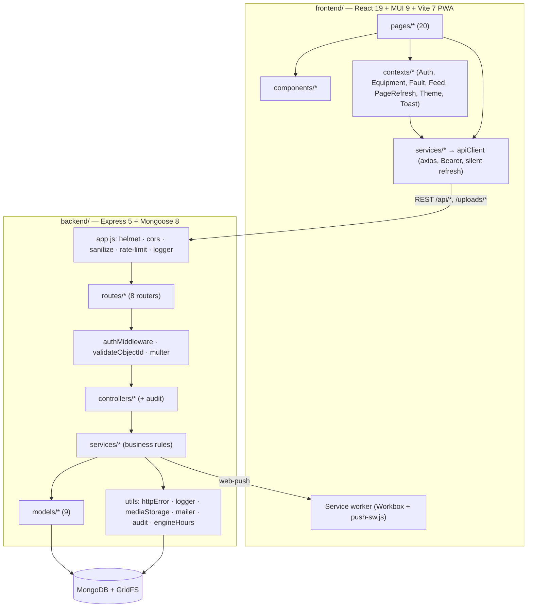

# FixFleet — Functional & Technical Specification

**Product:** FixFleet — a multi-tenant equipment, fault and maintenance management PWA.
**Repository:** `MaintenanceSystemApp` · **Version documented:** 1.0.7 (root `VERSION`, shared by frontend and backend) · **Baseline commit:** `f503a4a` · **Date:** 2026-10-08

| Chapter | Contents |
|---|---|
| [01 — Architecture & Layers](01-architecture-and-layers.md) | Architectural style, system context, layer mapping, RBAC matrix, cross-cutting concerns (auth, tenancy, validation, errors, logging, security, media, PWA, a11y), frontend route map, Tool/Equipment naming legacy. |
| [02 — Database & Schemas](02-database-and-schemas.md) | All 9 collections + GridFS: field dictionaries, constraints, defaults, indexes, TTLs, relationships (ERD), cascade rules, engine-hours derivation, seed data. |
| [03 — Dependencies & Configuration](03-dependencies-and-config.md) | Manifests, npm scripts, every backend/frontend dependency with resolved version and role, all environment variables, configuration files, CI and versioning, assets. |
| [04 — File Inventory](04-file-inventory.md) | File-by-file responsibilities, exports, dependencies and consumers for backend and frontend, plus test-suite inventory. |
| [05 — API & Workflows](05-api-and-workflows.md) | API conventions, error mapping, all endpoints with roles and request/response contracts, 13 end-to-end traces, frontend → backend usage matrix. |

See the **Browsable version** note at the end of this page for the HTML viewer.

---

## 1. Executive Summary

FixFleet lets an organization (typically a farm or fleet operator) track its machines, report and resolve faults, run recurring maintenance programs measured in engine hours and calendar days, keep PDF service manuals, and keep staff informed through in-app and push notifications. Each organization is an isolated tenant created by self-service signup; a platform superadmin oversees all tenants.

| Business capability | Who | Key backend pieces | Key UI pieces |
|---|---|---|---|
| Public landing page & in-app user guide | Anyone | — (static files in `frontend/public`) | `HomePage`, `GuidePage`, `PublicHeader`, `utils/guideContent` |
| Company signup with email verification, sign-in | Public → admin | `authService.register/verifyEmail/resendVerification/login`, `mailer`, `Company`, `User`, `RefreshToken` | `LoginComponent/*`, `VerifyEmailPage`, `ResendVerificationButton`, `AuthContext` |
| Session security (rotation, reuse detection, forced password change, reset by email) | All | `authService`, `authMiddleware`, `mailer` | `apiClient`, `ForcePasswordChangePage`, `ResetPasswordPage` |
| Fleet (equipment) registry | Admin (write), staff (read) | `equipmentService`, `Equipment` | `EquipmentsPage`, `EquipmentPage`, `ToolsPanel` |
| Fault reporting with photos | Everyone in a tenant | `faultService.createFault`, GridFS | `CreateFaultDialog`, bottom-nav FAB |
| Fault resolution & engine-hour tracking | Mechanic, admin | `faultService.closeFault`, `syncEquipmentEngineHours` | `CloseFaultDialog`, `FaultList`, `Dashboard` |
| Preventive maintenance programs with checklists | Mechanic, admin | `equipmentService.addSchedule/completeSchedule`, `Maintenance` | `EquipmentMaintenanceTab`, `EquipmentSchedulePage` |
| Service manuals (PDF) | Upload: mechanic/admin; read: all | `equipmentService.addBook`, `/uploads/:id` | `EquipmentBooksTab`, `EquipmentBooksPage`, `PdfViewerDialog` |
| Notifications (fault alerts, announcements) + Web Push | All tenant users | `notificationService`, `pushService`, `Notification`, `PushSubscription` | `NotificationBell`, `NotificationsPage`, `PushNotificationSettings`, `push-sw.js` |
| Company user management | Admin | `userService`, audit | `AdminDashboard`, `UserPanel` |
| Platform administration & audit | Superadmin | `superadminService`, `AuditLog` | `SuperAdminDashboard` |

## 2. Phase 0 — Scale Assessment

| Metric | Value |
|---|---|
| Tracked files | 342 (incl. 33 user-guide images, 2 landing-page screenshots, lockfiles, assets) |
| Backend source files / LOC | 59 / 6 704 (excluding tests) |
| Frontend source files / LOC | 115 / 19 132 (excluding tests; including `push-sw.js`) |
| Test files | 16 backend (≈ 277 cases) · 58 frontend (≈ 477 cases) |
| Database entities | 9 Mongoose models (+ 1 alias) over 9 collections, 5 embedded sub-schemas, 1 GridFS bucket |
| HTTP endpoints | ≈ 78 route registrations (including the `/api/tools` alias and multi-verb routes) across 8 routers + 3 app-level routes |
| Max directory depth | 6 |
| Domains | Identity/sessions, tenancy, fleet, faults, maintenance, manuals/media, notifications/push, platform admin/audit |

**Mode selected: Modular Multi-File** (well above the 25-file threshold, eight domains).

## 3. Architecture at a Glance



## 4. Project Map

```
MaintenanceSystemApp/
├── backend/                     Express 5 REST API (CommonJS)            → 04 §4.1
│   ├── app.js                   composition root, media route, health
│   ├── config/db.js             Mongo connection + sanitizeFilter
│   ├── constants/               roles, auth, audit, faultStatus, notifications, pagination, rateLimits, scheduleStatus
│   ├── models/                  AuditLog, Company, Equipment(+Tool), Fault, Maintenance, Notification, PushSubscription, RefreshToken, User
│   ├── middleware/              auth, error, sanitize, upload, validation
│   ├── routes/                  auth, equipment(+tool), fault, maintenance, notification, admin, superadmin
│   ├── controllers/             one per router (+ toolController alias, now unused)
│   ├── services/                auth, user, equipment, fault, maintenance, notification, push, superadmin
│   ├── utils/                   audit, equipmentEngineHours, httpError, logger, mailer, mediaStorage
│   ├── scripts/                 createSuperAdmin, migrateUploadsToGridFS
│   ├── seeders/seeder.js        dev demo data
│   └── __tests__/               16 suites + helpers/setup.js
├── frontend/                    React SPA / PWA (ESM)                     → 04 §4.2
│   ├── index.html, vite.config.js, eslint/babel/jest configs
│   ├── public/                  icons, push-sw.js, user-guide/ (guide HTML + images), home/ (landing screenshots)
│   ├── __tests__/               auth/legal page tests
│   └── src/
│       ├── main.jsx, routes.jsx, index.css, theme/, content/
│       ├── constants/           appVersion, audit, faultStatus, roles, routes
│       ├── services/            apiClient + 8 API modules
│       ├── contexts/            8 providers
│       ├── hooks/               4 hooks
│       ├── utils/               6 helper modules
│       ├── pages/               20 pages + 2 aliases + ErrorPage layout
│       └── components/          22 component folders
├── docs/                        API.md, ENV.md, RUNBOOK.md, CONTRIBUTING.md, system-spec/ (this)
├── media/                       README screenshots
├── VERSION                      single app version (patch bumped by the pre-commit hook on main)
├── .github/workflows/           CI: frontend lint/test/build, backend syntax check/test, tag v<VERSION> on main
├── .githooks/pre-commit         patch bump on main + spec viewer rebuild
└── .claude/plans/               historical multi-tenant migration plan
```

## 5. Domain Glossary

| Term | Meaning |
|---|---|
| Company / tenant | An organization; the isolation boundary (`companyId`). |
| Operator | Default tenant role; reports faults, reads manuals. |
| Mechanic | Maintains equipment: resolves faults, runs schedules, uploads manuals. |
| Admin | Tenant administrator; manages users and equipment, sends announcements. |
| Superadmin | Platform operator with no company; manages tenants. |
| Equipment / Tool | A machine (two names for the same entity — see [01 §1.7](01-architecture-and-layers.md#17-naming-legacy-tool-vs-equipment)). |
| Engine hours | Hour-meter reading; drives hour-based maintenance due dates; highest reading wins, and drops back only when the record holding it is reopened or deleted. |
| Maintenance schedule (routine) | Recurring task on a machine with an hour and/or day interval and a checklist. |
| Maintenance record (log) | A completed service entry. |
| Book / manual | A PDF attached to a machine. |
| Announcement | Admin/superadmin broadcast notification. |
| RTR | Refresh-token rotation with reuse detection. |
| Email verification | Signup step: the new admin gets a single-use 24 h link and has no session until it is used (`emailVerified`). |
| User guide | Illustrated end-user help, `frontend/public/user-guide/index.html`, shown in the app at `/guide`. |

## 6. Primary Workflows (summary — full traces in [05 §5.3](05-api-and-workflows.md#53-end-to-end-traces))

1. **Signup** — `SignupForm` → `POST /api/auth/register` → Company + unverified admin User → verification email → audit → "check your inbox"; the link → `VerifyEmailPage` → `POST /api/auth/verify-email` → RefreshToken + session → dashboard ([trace](05-api-and-workflows.md#5313-email-verification-after-signup)).
2. **Fault report** — `CreateFaultDialog` → `POST /api/faults` (multipart) → GridFS photos → Fault + equipment back-reference → per-recipient Notifications for mechanics/admins → Web Push → service worker → live refresh of open tabs.
3. **Fault resolution** — `CloseFaultDialog` → `PATCH /api/faults/:id/close` → closing hours → highest-wins engine-hours sync (reopen/delete can lower it again) → schedule statuses recomputed.
4. **Preventive maintenance** — schedule created → checklist ticked and notes saved on the schedule page → `POST …/complete` → Maintenance record (checklist snapshot + merged notes) → next due recomputed → checklist reset.
5. **User onboarding** — admin creates user (operator, forced change) → first login gated to the password + terms page → all sessions revoked after the change.
6. **Platform oversight** — superadmin stats, company activation (revokes sessions), cross-tenant user role/password/delete, platform announcements, audit trail.

## 7. Audit Observations

Factual findings from reading the code. They do not change the specification above; they mark places where behaviour, comments or configuration disagree, ordered by impact. Re-verified against `f503a4a` on 2026-10-08: the five earlier findings still hold (evidence line numbers refreshed); two new ones come from the email-verification change (#2, #4). Drift found in this run in `docs/API.md`, `docs/ENV.md`, `docs/CONTRIBUTING.md`, `docs/RUNBOOK.md` and the app READMEs (missing verification endpoints, old CI description, `/health` `version` field) was corrected in those files.

| # | Area | Finding | Evidence |
|---|---|---|---|
| 1 | Session availability | The service worker gets its token by calling `POST /api/auth/refresh`: once per received push (`syncAppBadge`) and twice per tapped notification (`markNotificationRead` then `syncAppBadge`). That route sits behind `authLimiter` (20 requests / 15 min **per IP**), whose counter is shared with login, register, verify-email and resend-verification. A burst of pushes, or several users behind one office NAT, exhausts it. The page's own silent refresh then gets `429`, which `apiClient` handles by clearing the token and redirecting to `/login`. Each call also rotates the refresh token. The worker hard-codes same-origin `/api/...` URLs, so in a split-origin deployment (absolute `VITE_API_URL`) all three calls miss the API. | `frontend/public/push-sw.js:31`, `:72`, `:148`; `backend/routes/authRoutes.js:24`, `:43`–`:49`; `backend/constants/rateLimits.js:14`; `frontend/src/services/apiClient.js:145` |
| 2 | Signup integrity | Unverified signups never expire: nothing deletes a user whose `emailVerified` stays `false`, so the company and the email address stay reserved, and re-registering returns `User with this email already exists`. Whoever owns the inbox can only resend the link. Following it signs them in to the account and company the original registrant created, with the password that registrant chose. Separately, if `sendVerificationEmail`'s token write throws after the user insert, the `catch` deletes the company but not the user. That leaves an unverified user pointing at a missing company. | `backend/services/authService.js:259`, `:262`, `:265`–`:267`, `:354` |
| 3 | Performance | Fault and equipment lists are unpaginated by default, and the dashboard, the equipment page and `FaultContext` each fetch the full company fault list, refreshed every 30 s while visible. Cost grows linearly with fault history. (`GET /api/equipment` no longer populates faults.) | `backend/services/faultService.js:36`; `frontend/src/pages/Dashboard.jsx:195`; `frontend/src/pages/EquipmentsPage.jsx:54`; `frontend/src/contexts/FaultContext.jsx:23`; `frontend/src/contexts/PageRefreshContext.jsx:40` |
| 4 | Rate limiting | `/forgot-password` and `/resend-verification` share one `passwordResetLimiter` instance, so they share the 3-per-15-min per-email counter: three resends block a password reset for that email, and the reverse. The resend `429` also says "Too many reset requests for this email". | `backend/routes/authRoutes.js:33`, `:36`, `:46`, `:49` |
| 5 | Docs drift | The English Terms of Service (v1.3) still list "spare part inventory management" as a core feature (the parts domain was removed). The `syncEquipmentEngineHours` JSDoc says closed faults contribute `closingEngineHours` *and* `engineHours`, but the query selects only `closingEngineHours`. | `frontend/src/content/legalDocuments.js:21`; `backend/utils/equipmentEngineHours.js:8`, `:38` |
| 6 | Unused code | `controllers/toolController.js` is imported nowhere (its only consumer, the `adminRoutes.js` equipment aliases, was removed), yet `models/Tool.js` still cites it as part of the alias chain. Frontend methods with no caller: `faultsService.getById` and `equipmentService.addChecklistItem` / `deleteChecklistItem`, so `GET /api/faults/:id` and the checklist add/delete endpoints have no UI consumer. | `backend/controllers/toolController.js:1`; `backend/models/Tool.js:5`; `frontend/src/services/faultsService.js:10`; `frontend/src/services/equipmentService.js:114`, `:130` |
| 7 | CI / hygiene | The backend has no linter: no ESLint config and no `lint` script, so CI checks backend syntax and tests only. | `backend/package.json`; `.github/workflows/ci.yml:55` |

**Browsable version:** open `docs/system-spec/index.html` in a browser. It is generated from these Markdown files by `docs/system-spec/_build/build.mjs` and kept in sync automatically: the pre-commit hook rebuilds and stages it whenever a spec file, the template or the viewer config is committed, and `npm run docs:watch` (repo root) rebuilds it on every save while you edit. One-time setup: `npm install --prefix docs/system-spec/_build`.
