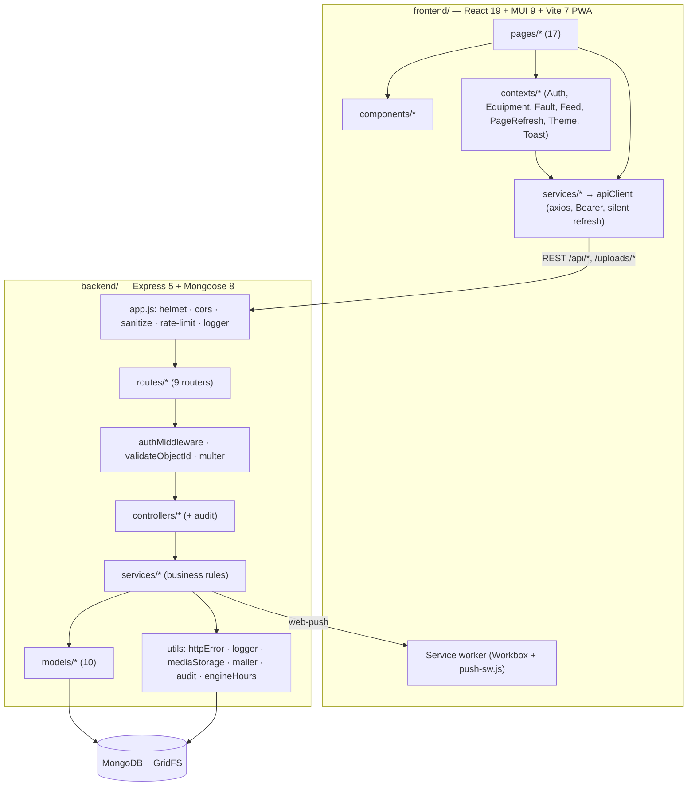

# FixFleet — Functional & Technical Specification

**Product:** FixFleet — a multi-tenant equipment, fault and maintenance management PWA.
**Repository:** `MaintenanceSystemApp` · **Version documented:** 1.0.8 (frontend and backend) · **Baseline commit:** `040749e` · **Date:** 2026-10-08

| Chapter | Contents |
|---|---|
| [01 — Architecture & Layers](01-architecture-and-layers.md) | Architectural style, system context, layer mapping, RBAC matrix, cross-cutting concerns (auth, tenancy, validation, errors, logging, security, media, PWA, a11y), frontend route map, Tool/Equipment naming legacy. |
| [02 — Database & Schemas](02-database-and-schemas.md) | All 10 collections + GridFS: field dictionaries, constraints, defaults, indexes, TTLs, relationships (ERD), cascade rules, engine-hours derivation, seed data. |
| [03 — Dependencies & Configuration](03-dependencies-and-config.md) | Manifests, npm scripts, every backend/frontend dependency with resolved version and role, all environment variables, configuration files, CI and versioning, assets. |
| [04 — File Inventory](04-file-inventory.md) | File-by-file responsibilities, exports, dependencies and consumers for backend and frontend, plus test-suite inventory. |
| [05 — API & Workflows](05-api-and-workflows.md) | API conventions, error mapping, all endpoints with roles and request/response contracts, 12 end-to-end traces, frontend → backend usage matrix. |

**Browsable version:** open `docs/system-spec/index.html` in a browser. It is generated from these Markdown files and kept in sync automatically: the pre-commit hook rebuilds it whenever a spec file is committed, and `npm run docs:watch` (repo root) rebuilds it on every save while you edit. One-time setup: `npm install` in the repo root.

---

## 1. Executive Summary

FixFleet lets an organization (typically a farm or fleet operator) track its machines, report and resolve faults, run recurring maintenance programs measured in engine hours and calendar days, keep PDF service manuals, and keep staff informed through in-app and push notifications. Each organization is an isolated tenant created by self-service signup; a platform superadmin oversees all tenants.

| Business capability | Who | Key backend pieces | Key UI pieces |
|---|---|---|---|
| Company signup & sign-in | Public → admin | `authService.register/login`, `Company`, `User`, `RefreshToken` | `LoginComponent/*`, `AuthContext` |
| Session security (rotation, reuse detection, forced password change, reset by email) | All | `authService`, `authMiddleware`, `mailer` | `apiClient`, `ForcePasswordChangePage`, `ResetPasswordPage` |
| Fleet (equipment) registry | Admin (write), staff (read) | `equipmentService`, `Equipment` | `EquipmentsPage`, `EquipmentPage`, `ToolsPanel` |
| Fault reporting with photos | Everyone in a tenant | `faultService.createFault`, GridFS | `CreateFaultDialog`, bottom-nav FAB |
| Fault resolution & engine-hour tracking | Mechanic, admin | `faultService.closeFault`, `syncEquipmentEngineHours` | `CloseFaultDialog`, `FaultList`, `Dashboard` |
| Preventive maintenance programs with checklists | Mechanic, admin | `equipmentService.addSchedule/completeSchedule`, `Maintenance` | `EquipmentMaintenanceTab`, `EquipmentSchedulePage` |
| Service manuals (PDF) | Upload: mechanic/admin; read: all | `equipmentService.addBook`, `/uploads/:id` | `EquipmentBooksTab`, `EquipmentBooksPage`, `PdfViewerDialog` |
| Notifications (fault alerts, announcements) + Web Push | All tenant users | `notificationService`, `pushService`, `Notification`, `PushSubscription` | `NotificationBell`, `NotificationsPage`, `PushNotificationSettings`, `push-sw.js` |
| Company user management | Admin | `userService`, audit | `AdminDashboard`, `UserPanel` |
| Platform administration & audit | Superadmin | `superadminService`, `AuditLog` | `SuperAdminDashboard` |
| Spare parts inventory | Mechanic, admin (API only) | `partService`, `Part` | — (no UI) |

## 2. Phase 0 — Scale Assessment

| Metric | Value |
|---|---|
| Tracked files | 322 (incl. 30 user-guide images, lockfiles, assets) |
| Backend source files / LOC | 62 / 6 972 (excluding tests) |
| Frontend source files / LOC | 112 / 18 709 (excluding tests; including `push-sw.js`) |
| Test files | 17 backend (≈ 284 cases) · 57 frontend (≈ 479 cases) |
| Database entities | 10 Mongoose models (+ 1 alias) over 10 collections, 5 embedded sub-schemas, 1 GridFS bucket |
| HTTP endpoints | ≈ 90 route registrations (including aliases and multi-verb routes) across 9 routers + 3 app-level routes |
| Max directory depth | 6 |
| Domains | Identity/sessions, tenancy, fleet, faults, maintenance, manuals/media, notifications/push, parts, platform admin/audit |

**Mode selected: Modular Multi-File** (well above the 25-file threshold, nine domains).

## 3. Architecture at a Glance



## 4. Project Map

```
MaintenanceSystemApp/
├── backend/                     Express 5 REST API (CommonJS)            → 04 §4.1
│   ├── app.js                   composition root, media route, health
│   ├── config/db.js             Mongo connection + sanitizeFilter
│   ├── constants/               roles, auth, audit, faultStatus, notifications, pagination, rateLimits, scheduleStatus
│   ├── models/                  AuditLog, Company, Equipment(+Tool), Fault, Maintenance, Notification, Part, PushSubscription, RefreshToken, User
│   ├── middleware/              auth, error, sanitize, upload, validation
│   ├── routes/                  auth, equipment(+tool), fault, maintenance, part, notification, admin, superadmin
│   ├── controllers/             one per router (+ toolController alias)
│   ├── services/                auth, user, equipment, fault, maintenance, part, notification, push, superadmin
│   ├── utils/                   audit, equipmentEngineHours, httpError, logger, mailer, mediaStorage
│   ├── scripts/                 createSuperAdmin, migrateUploadsToGridFS
│   ├── seeders/seeder.js        dev demo data
│   └── __tests__/               16 suites + helpers/setup.js
├── frontend/                    React SPA / PWA (ESM)                     → 04 §4.2
│   ├── index.html, vite.config.js, eslint/babel/jest configs
│   ├── public/                  icons, push-sw.js
│   ├── __tests__/               auth/legal page tests
│   └── src/
│       ├── main.jsx, routes.jsx, index.css, theme/, content/
│       ├── constants/           appVersion, audit, faultStatus, roles, routes
│       ├── services/            apiClient + 8 API modules
│       ├── contexts/            8 providers
│       ├── hooks/               4 hooks
│       ├── utils/               5 helper modules
│       ├── pages/               17 pages + 2 aliases
│       └── components/          ~25 component folders
├── docs/                        API.md, ENV.md, RUNBOOK.md, CONTRIBUTING.md, user-guide/, system-spec/ (this)
├── media/                       README screenshots
├── .github/workflows/           frontend build CI
├── .githooks/pre-commit         shared version bump on main
└── .claude/plans/               historical multi-tenant migration plan
```

## 5. Domain Glossary

| Term | Meaning |
|---|---|
| Company / tenant | An organization; the isolation boundary (`companyId`). |
| Operator | Default tenant role; reports faults, reads manuals. |
| Mechanic | Maintains equipment: resolves faults, runs schedules, uploads manuals. |
| Admin | Tenant administrator; manages users and equipment, sends announcements. |
| Superadmin | Platform operator with no company; manages tenants. |
| Equipment / Tool | A machine (two names for the same entity — see [01 §1.7](01-architecture-and-layers.md#17-naming-legacy-tool-vs-equipment)). |
| Engine hours | Hour-meter reading; drives hour-based maintenance due dates; only ever increases. |
| Maintenance schedule (routine) | Recurring task on a machine with an hour and/or day interval and a checklist. |
| Maintenance record (log) | A completed service entry. |
| Book / manual | A PDF attached to a machine. |
| Announcement | Admin/superadmin broadcast notification. |
| RTR | Refresh-token rotation with reuse detection. |

## 6. Primary Workflows (summary — full traces in [05 §5.3](05-api-and-workflows.md#53-end-to-end-traces))

1. **Signup** — `SignupForm` → `POST /api/auth/register` → Company + admin User + RefreshToken → audit → dashboard.
2. **Fault report** — `CreateFaultDialog` → `POST /api/faults` (multipart) → GridFS photos → Fault + equipment back-reference → per-recipient Notifications for mechanics/admins → Web Push → service worker → live refresh of open tabs.
3. **Fault resolution** — `CloseFaultDialog` → `PATCH /api/faults/:id/close` → closing hours → highest-wins engine-hours sync → schedule statuses recomputed.
4. **Preventive maintenance** — schedule created → checklist ticked and notes saved on the schedule page → `POST …/complete` → Maintenance record (checklist snapshot + merged notes) → next due recomputed → checklist reset.
5. **User onboarding** — admin creates user (operator, forced change) → first login gated to the password + terms page → all sessions revoked after the change.
6. **Platform oversight** — superadmin stats, company activation (revokes sessions), cross-tenant user role/password/delete, platform announcements, audit trail.

## 7. Audit Observations

Factual findings from reading the code. They do not change the specification above; they mark places where behaviour, comments or configuration disagree, ordered by impact.

| # | Area | Finding | Evidence |
|---|---|---|---|
| 1 | Security | `PATCH /api/faults/:id/close` and `PUT\|PATCH /api/faults/:id/reopen` populate `operator` and `resolvedBy` without field selection, and `User.password` is not `select: false`, so these responses include the bcrypt password hashes of the reporter and resolver. Every other fault endpoint selects `name email role`. | `backend/services/faultService.js:195`, `:229`; `backend/models/User.js:57` |
| 2 | Push / service worker | `push-sw.js` calls `/api/notifications/unread-count` and `PATCH /api/notifications/:id/read` with `credentials: 'include'` and no Bearer token, relying on a `token` cookie. The API accepts Bearer only, so both calls always return 401: tapping a push never marks it read, and the background app-badge sync never works. Comments in `push-sw.js` and `useAuthenticatedBlobUrl.js` still describe cookie auth. | `frontend/public/push-sw.js:52`, `:129`; `backend/middleware/authMiddleware.js:35` |
| 3 | Data integrity | `syncEquipmentEngineHours` seeds the maximum with the current `currentEngineHours`, so the reading can never decrease. JSDoc on `reopenFault` and `deleteMaintenance` says the value "may drop". A wrong (too high) reading can only be corrected via `PUT /api/equipment/:id`. | `backend/utils/equipmentEngineHours.js:43`; `backend/services/faultService.js:213`; `backend/services/maintenanceService.js:129` |
| 4 | Media | `/uploads/:id` serves any GridFS file that no document references (the "unassigned" fallback) to any authenticated user of any tenant, and ownership is checked with a substring regex rather than an exact `/uploads/<id>` match. | `backend/app.js:116` |
| 5 | Orphaned data | Deleting equipment runs `Fault.deleteMany` without removing those faults' photo files from GridFS, and leaves `Notification` documents that point at the deleted equipment/faults. `userService.deleteUser` (admin/superadmin) does not delete the user's `RefreshToken` or `PushSubscription` rows (self-deletion does). | `equipmentService.deleteTool`, `userService.deleteUser`, `authService.deleteAccount` |
| 6 | Validation mismatch | The fault form requires `code`; the API and schema treat it as optional. A rejected upload MIME type surfaces as HTTP 500 (plain `Error`) instead of 400. | `frontend/src/components/Fault/FaultForms/FaultForms.jsx:30`; `uploadMiddleware.js` + `errorMiddleware.js` |
| 7 | Unused surface | `/api/parts` (whole domain), `POST /api/maintenance`, `GET /api/maintenance/:id`, `/api/admin/equipment` and `/api/admin/tools` have no frontend consumer. Unused frontend code: `adminService` equipment/tool methods, `maintenanceService.createMaintenance/getMaintenanceById`, `toolsService`, `EditFaultForm`, `UpdateUserForm`, `components/TabPanel`, empty `FaultCard.module.css`. Unused backend constant `ACCESS_COOKIE_MAX_AGE`. | [05 §5.4](05-api-and-workflows.md#54-frontend--backend-endpoint-usage-matrix) |
| 8 | Dependencies | Declared but never imported in the frontend: `@mui/x-data-grid`, `notistack`, `@fullcalendar/react`, `@fullcalendar/daygrid`, `fullcalendar`, `@fontsource/roboto`, `dotenv`. | [03 §3.3](03-dependencies-and-config.md#33-frontend-dependencies-frontendpackagejson) |
| 9 | Performance | `GET /api/equipment` populates every fault of every machine, and fault/equipment lists are unpaginated by default; the dashboard, equipment and reports pages each fetch the full fault list and refresh it every 30 s. Cost grows linearly with fault history. | `equipmentService.getAllTools`, `Dashboard.jsx#fetchData`, `PageRefreshContext` |
| 10 | Tenancy exposure | Operators can list all company faults through the API (`GET /api/faults`); the UI only filters to their own on the dashboard. May be intentional. | `faultService.getAllFaults`, `Dashboard.jsx#operatorFaults` |
| 11 | CI / hygiene | CI builds only the frontend — no backend checks, tests or lint. `backend/coverage/coverage-summary.json` is committed and stale. `.vscode/settings.json` is tracked despite being git-ignored. `config/db.js` logs with `console` instead of `logger`. `CURRENT_TERMS_VERSION` in `authService.js` is a manual copy of the version in `legalDocuments.js`. | [03 §3.6](03-dependencies-and-config.md#36-build-versioning--ci) |
| 12 | Docs drift | Controller JSDoc for `updateFault` says `PATCH /api/faults/:id`; only `PUT` is routed. | `backend/controllers/faultController.js:114`, `backend/routes/faultRoutes.js` |
